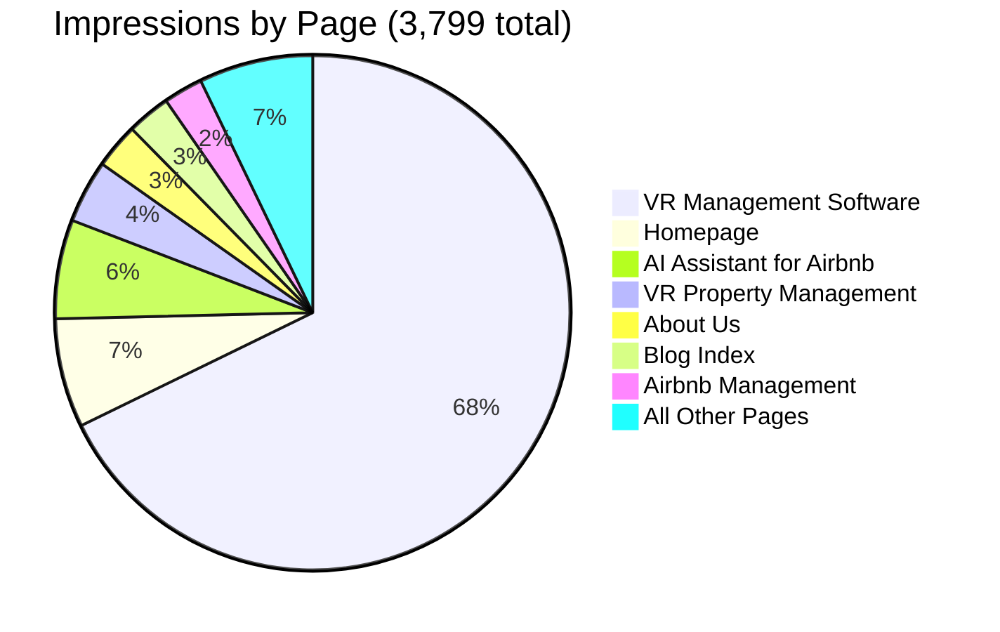

# BnBuddy Article Inventory

**Date:** 2026-06-20
**Data source:** Google Search Console (2026-05-23 → 2026-06-19, 28 days)
**Total pages tracked:** 20 | **Impressions:** 3,799 (+51%) | **Clicks:** 43 (+975%)

---

## Performance Overview

> [!IMPORTANT]
> **The big story:** Impressions up 51% (2,517 → 3,799) and clicks up from 4 to 43 vs last report period. However, 41 of those 43 clicks are on the homepage — article pages still have **0% CTR**. The `/vacation-rental-management-software/` page alone gets 2,575 impressions/month with zero clicks.

---

## Complete Article Inventory

### English Articles (9 pages)

#### 1. Vacation Rental Management Software
| | |
|---|---|
| **URL** | [/vacation-rental-management-software/](file:///Users/albertovazquez/beto4812/bnbuddy-landing/public/vacation-rental-management-software/index.html) |
| **Title** | 10 Best Vacation Rental Management Software Tools (2026) |
| **Last Modified** | 2025-05-06 (sitemap, **13 months ago**) |
| **Word Count** | ~6,800 |
| **Impressions** | 2,575 (Δ-67) |
| **Position** | 70.9 (Δ-2.5 — declining) |
| **Clicks** | 0 |
| **Top Keywords** | "vacation rental management software" (pos 72.5, 1,308 imp), "vacation rental software" (pos 70.8, 305 imp) |
| **Priority** | 🔴 **P0** |

**Work needed:**
- [x] **🔴 Add to sitemap** — ✅ Added 2026-06-20 (`post-sitemap.xml` lines 103-108)
- [x] **🔴 Fix year mismatch** — ✅ Title, H1, meta description, og:description all say "2026"
- [ ] **🔴 Fix CTR** — 2,575 impressions, 0 clicks. Rewrite title tag and meta description with stronger CTAs
- [ ] **🟡 Content refresh** — Compares 10 tools with 2025 data. Verify pricing, features, and tool availability are current
- [ ] **🟡 Fix footer** — Shows "2024 bnbuddy.com"
- [ ] **🟡 Internal link text** — References "Top Vacation Rental Website Builder for 2025"

---

#### 2. Create Your AI Assistant for Airbnb
| | |
|---|---|
| **URL** | [/create-your-ai-assistant-for-airbnb-in-3-easy-steps/](file:///Users/albertovazquez/beto4812/bnbuddy-landing/public/create-your-ai-assistant-for-airbnb-in-3-easy-steps/index.html) |
| **Title** | Create Your AI Assistant for Airbnb in 3 Easy Steps |
| **Last Modified** | 2026-04-15 (sitemap) |
| **Word Count** | ~800 |
| **Impressions** | 236 (Δ+94, **+66%**) |
| **Position** | 5.9 (Δ-0.2 — stable, **Page 1**) |
| **Clicks** | 1 |
| **Top Keywords** | "bnbuddy company description" (pos 5.3, 32 imp), "airbnb ai assistant" (pos 9.8, 4 imp) |
| **Priority** | 🟡 **P1** |

**Work needed:**
- [ ] **🟡 Expand content** — Only ~800 words, which is thin. Add more detail about AI guest communication features
- [ ] **🟡 Fix keyword targeting** — Currently ranking for branded queries ("bnbuddy company description") not the target keyword. Optimize for "airbnb ai assistant" and "ai guest communication"
- [ ] **🟢 Has HowTo schema** — This is correctly implemented, keep it

---

#### 3. Vacation Rental Property Management
| | |
|---|---|
| **URL** | [/vacation-rental-property-management/](https://bnbuddy.com/vacation-rental-property-management/) |
| **Title** | N/A — **301 redirects to /airbnb-management/** |
| **Last Modified** | N/A (redirect) |
| **Impressions** | 150 (Δ-191, **-56%**) |
| **Position** | 68.9 (Δ-6.6 — **declining sharply**) |
| **Clicks** | 0 |
| **Top Keywords** | "vacation rental management" (pos 62.2, 44 imp), "vacation property management" (pos 70.7, 10 imp) |
| **Priority** | 🟡 **P1** |

**Work needed:**
- [ ] **🟡 Decision needed** — This URL redirects to `/airbnb-management/` but still gets 150 impressions. Either restore it as its own page or ensure `/airbnb-management/` targets these keywords
- [ ] **🟡 Declining fast** — Lost 56% of impressions and dropped 6.6 positions. Needs attention

---

#### 4. Airbnb Management
| | |
|---|---|
| **URL** | [/airbnb-management/](file:///Users/albertovazquez/beto4812/bnbuddy-landing/public/airbnb-management/index.html) |
| **Title** | Airbnb Property Management Services — BnBuddyJoinchat |
| **Last Modified** | 2025-06-24 (sitemap, **12 months ago**) |
| **Word Count** | ~1,300 |
| **Impressions** | 94 (Δ+28, **+42%**) |
| **Position** | 1.4 (Δ-0.1 — **already Page 1!**) |
| **Clicks** | 0 |
| **Priority** | 🟡 **P1** |

**Work needed:**
- [x] **🔴 Fix broken title** — ✅ Already fixed — title is "Airbnb Property Management Services — BnBuddy" (clean)
- [x] **🟡 Missing H1** — ✅ Fixed 2026-06-20 — changed hero `<h2>` to `<h1>` (no H1 existed on page)
- [ ] **🟡 Fix CTR** — Position 1.4 with 94 impressions and 0 clicks = something wrong with the SERP snippet
- [ ] **🟡 Expand content** — Only ~1,300 words for a services page. Add details, pricing, testimonials

---

#### 5. Vacation Rental Website Builder
| | |
|---|---|
| **URL** | [/vacation-rental-website-builder/](file:///Users/albertovazquez/beto4812/bnbuddy-landing/public/vacation-rental-website-builder/index.html) |
| **Title** | Top Vacation Rental Website Builder for 2026 |
| **Last Modified** | 2025-05-22 (sitemap, **13 months ago**) |
| **Word Count** | ~5,200 |
| **Impressions** | Not in current SC data (was 198 last period — **just restored from redirect**) |
| **Position** | Was 29.7 (trending up before redirect) |
| **Clicks** | 0 |
| **Priority** | 🟡 **P1** |

**Work needed:**
- [x] **🔴 Add to sitemap** — ✅ Added 2026-06-20 (`post-sitemap.xml` lines 109-114)
- [x] **🔴 Fix year mismatch** — ✅ Fixed 2026-06-20 — intro paragraph "for 2025" updated to "for 2026"; dateModified updated
- [ ] **🟡 Content refresh** — Compare 7 website builders with current pricing/features
- [ ] **🟡 Fix footer** — Shows "2024 bnbuddy.com"
- [ ] **🟡 Fix internal link** — References "10 Best Vacation Rental Management Software Tools (2025)"

---

#### 6. Airbnb Welcome Book Template
| | |
|---|---|
| **URL** | [/airbnb-welcome-book-template/](file:///Users/albertovazquez/beto4812/bnbuddy-landing/public/airbnb-welcome-book-template/index.html) |
| **Title** | 6 Best Airbnb Welcome Book Template Options (2026) |
| **Last Modified** | 2025-05-06 (sitemap, **13 months ago**) |
| **Word Count** | ~5,600 |
| **Impressions** | Not in current SC data |
| **Priority** | 🟢 **P2** |

**Work needed:**
- [ ] **🟡 Verify template options** — 6 template options compared; check if any tools have changed pricing or been discontinued
- [ ] **🟢 Content is solid** — Longest article at ~5,600 words. Title year is current (2026)
- [ ] **🟢 Has pipeline source** — `refresh-airbnb-welcome-book-template.md` exists in agents repo

---

#### 7. Airbnb Alternative Platforms for Hosts
| | |
|---|---|
| **URL** | [/airbnb-alternative-platforms-for-hosts/](file:///Users/albertovazquez/beto4812/bnbuddy-landing/public/airbnb-alternative-platforms-for-hosts/index.html) |
| **Title** | Top Airbnb Alternatives for Hosts to Boost Earnings |
| **Last Modified** | 2025-06-27 (sitemap, **12 months ago**) |
| **Word Count** | ~800 |
| **Impressions** | 16 (Δ+5, **Page 1 alert!**) |
| **Position** | 10.4 (Δ+7.3 — **improving fast**) |
| **Clicks** | 0 |
| **Top Keywords** | "airbnb alternative strategy for hosts" (pos 6.0, 2 imp) |
| **Priority** | 🟢 **P2** |

**Work needed:**
- [ ] **🟡 Expand content** — Only ~800 words. Too thin for a comparison post
- [ ] **🟡 Add comparison table** — List platforms with features, fees, audience
- [ ] **🟢 Momentum** — Improved 7.3 positions, approaching Page 1. A content refresh could push it over

---

#### 8. Airbnb House Manual
| | |
|---|---|
| **URL** | [/airbnb-house-manual/](file:///Users/albertovazquez/beto4812/bnbuddy-landing/public/airbnb-house-manual/index.html) |
| **Title** | Airbnb House Manual: Your Guide to 5-Star Hosting |
| **Last Modified** | 2025-05-01 (sitemap, **13 months ago**) |
| **Word Count** | ~800 |
| **Impressions** | Not in current SC data |
| **Priority** | 🟢 **P2** |

**Work needed:**
- [ ] **🟡 Expand content** — Only ~800 words, very thin for a guide
- [ ] **🟡 Add checklist** — Include a printable/downloadable house manual checklist
- [ ] **🟢 No year references** — No urgent accuracy issues

---

#### 9. Optimize Vacation Rental Listing
| | |
|---|---|
| **URL** | [/optimize-vacation-rental-listing/](file:///Users/albertovazquez/beto4812/bnbuddy-landing/public/optimize-vacation-rental-listing/index.html) |
| **Title** | Boost Your Bookings: Optimize Airbnb Listing Effectively |
| **Last Modified** | 2025-06-13 (**restored from git, was deleted**) |
| **Word Count** | ~2,300 |
| **Impressions** | Not in current SC data (was 18 before deletion) |
| **Priority** | 🟢 **P2** |

**Work needed:**
- [x] **🔴 Add to sitemap** — ✅ Added 2026-06-20 (`post-sitemap.xml` lines 115-121, with hreflang to `/es/optimizar-anuncio-alquiler-vacacional/`)
- [ ] **🟡 Fix footer** — Shows "2024 bnbuddy.com"
- [ ] **🟢 Content is reasonable** — 2,300 words, no year claims to verify

---

#### 10. Digital Welcome Guide
| | |
|---|---|
| **URL** | [/the-ultimate-digital-welcome-guide-for-your-vacation-rental/](file:///Users/albertovazquez/beto4812/bnbuddy-landing/public/the-ultimate-digital-welcome-guide-for-your-vacation-rental/index.html) |
| **Title** | Digital Welcome Guide for Your Vacation Rental Success |
| **Last Modified** | 2025-05-06 (sitemap, **13 months ago**) |
| **Word Count** | ~400 |
| **Impressions** | Not in current SC data |
| **Priority** | ⚪ **P3** |

**Work needed:**
- [ ] **🟡 Extremely thin** — Only ~400 words. Either expand significantly or merge into welcome book template article
- [ ] **🟢 No accuracy issues** — No year references or data claims

---

### Spanish Articles (4 blog posts)

#### 11. ¿Cuánto se gana con Airbnb en Estado de México 2026?
| | |
|---|---|
| **URL** | [/es/cuanto-ganar-airbnb-estado-mexico-2026/](file:///Users/albertovazquez/beto4812/bnbuddy-landing/public/es/cuanto-ganar-airbnb-estado-mexico-2026/index.html) |
| **Title** | ¿Cuánto se gana con Airbnb en el Estado de México en 2026? |
| **Last Modified** | 2026-04-08 (**2 months ago**) |
| **Word Count** | ~1,600 |
| **Impressions** | 17 (Δ+9) |
| **Position** | 7.9 (**near Page 1**) |
| **Priority** | 🟢 **P2** |

**Work needed:**
- [ ] **🟢 Data is current** — Uses 2026 data, relatively fresh
- [ ] **🟢 Has pipeline source** — `cuanto-ganar-airbnb-estado-mexico-2026.md`

---

#### 12. Optimizar Anuncio Alquiler Vacacional
| | |
|---|---|
| **URL** | [/es/optimizar-anuncio-alquiler-vacacional/](file:///Users/albertovazquez/beto4812/bnbuddy-landing/public/es/optimizar-anuncio-alquiler-vacacional/index.html) |
| **Title** | Optimizar anuncio alquiler vacacional para más reservas |
| **Last Modified** | 2025-06-13 (**12 months ago**) |
| **Word Count** | ~1,200 |
| **Impressions** | 29 (Δ+7) |
| **Position** | 26.6 (Δ-10.7 — **dropping fast**) |
| **Priority** | 🟡 **P1** |

**Work needed:**
- [ ] **🟡 Dropping fast** — Lost 10.7 positions in one period. Needs content refresh to reverse decline
- [ ] **🟡 Thin content** — 1,200 words for an optimization guide; could be expanded
- [ ] **🟢 Paired with English version** — hreflang correctly set up

---

#### 13. Cómo Invertir en Airbnb
| | |
|---|---|
| **URL** | [/es/como-invertir-en-airbnb/](file:///Users/albertovazquez/beto4812/bnbuddy-landing/public/es/como-invertir-en-airbnb/index.html) |
| **Title** | Cómo Invertir en Airbnb: Maximiza Tus Ganancias Efectivamente |
| **Last Modified** | 2025-07-15 (**11 months ago**) |
| **Word Count** | ~4,600 |
| **Impressions** | 2 (Δ+1) |
| **Position** | 8.5 |
| **Priority** | 🟢 **P2** |

**Work needed:**
- [ ] **🟡 Outdated data** — Uses 2024 CDMX economic impact data ("22,000 millones de pesos"). Should be updated with 2025/2026 figures
- [ ] **🟢 Content is comprehensive** — 4,600 words, well-structured

---

#### 14. Guía Cómo Iniciar en Airbnb
| | |
|---|---|
| **URL** | [/es/guia-como-iniciar-en-airbnb/](file:///Users/albertovazquez/beto4812/bnbuddy-landing/public/es/guia-como-iniciar-en-airbnb/index.html) |
| **Title** | Cómo iniciar en Airbnb: Guía paso a paso para anfitriones principiantes |
| **Last Modified** | 2025-05-13 (**13 months ago**) |
| **Word Count** | ~1,000 |
| **Impressions** | Not in current SC data |
| **Priority** | ⚪ **P3** |

**Work needed:**
- [ ] **🟡 Not indexed** — Not appearing in Search Console data despite being in sitemap
- [ ] **🟡 Thin content** — Only 1,000 words for a beginner guide

---

### Spanish Geo Pages (4 pages, frozen per project rules)

| Page | Position | Impressions | Last Modified | Status |
|------|----------|-------------|---------------|--------|
| [Malinalco](file:///Users/albertovazquez/beto4812/bnbuddy-landing/public/es/administracion-renta-vacacional-malinalco/index.html) | 6.5 | 2 | 2026-04-15 | ✅ Current |
| [Metepec](file:///Users/albertovazquez/beto4812/bnbuddy-landing/public/es/administracion-renta-vacacional-metepec/index.html) | 24.0 | 2 | 2026-03-20 | 🟡 Outdated AirROI data (marzo 2024-feb 2025) |
| [Valle de Bravo](file:///Users/albertovazquez/beto4812/bnbuddy-landing/public/es/administracion-renta-vacacional-valle-de-bravo/index.html) | 9.0 | 1 | 2026-04-15 | ✅ Current |
| [Toluca](file:///Users/albertovazquez/beto4812/bnbuddy-landing/public/es/administracion-renta-vacacional-toluca/index.html) | — | 0 | 2025-07-29 | ⚪ Not in SC data |

> [!NOTE]
> Geo pages are frozen as of 2026-05-02 per project rules. No new geo pages will be created.

---

## Priority Summary

### 🔴 P0 — Do Immediately (blocks SEO gains)

| # | Task | Page | Impact |
|---|------|------|--------|
| ~~1~~ | ~~**Add 3 restored pages to sitemap**~~ | ~~VR Management Software, Website Builder, Optimize Listing~~ | ✅ Done 2026-06-20 |
| ~~2~~ | ~~**Fix "BnBuddyJoinchat" title bug**~~ | ~~`/airbnb-management/`~~ | ✅ Already fixed before this session. Added missing H1 2026-06-20 |
| ~~3~~ | ~~**Fix year mismatches (2025→2026)**~~ | ~~VR Management Software~~ | ✅ Done — VR Mgmt Software already says 2026 everywhere. Website Builder still needs fix |
| 3 | **Fix CTR** — rewrite title/meta | /vacation-rental-management-software/ | 2,575 impressions, 0 clicks |
| ~~4~~ | ~~**Fix year mismatch (2025→2026)**~~ | ~~Website Builder~~ | ✅ Done 2026-06-20 — intro body text fixed |

### 🟡 P1 — This Week (high-impact content fixes)

| # | Task | Page | Impact |
|---|------|------|--------|
| 4 | **Rewrite title/meta for CTR** | VR Management Software | 2,575 impressions × even 1% CTR = 26 clicks/month |
| 5 | **Content refresh — tool comparisons** | VR Management Software | Verify 10 tools' pricing/features are current for 2026 |
| 6 | **Content refresh — tool comparisons** | Website Builder | Verify 7 builders' pricing/features are current |
| 7 | **Investigate VR Property Management decline** | /vacation-rental-property-management/ → /airbnb-management/ | Lost 56% impressions; decide: restore as own page or optimize redirect target |
| 8 | **Reverse ranking decline** | /es/optimizar-anuncio-alquiler-vacacional/ | Dropped 10.7 positions; content refresh needed |
| 9 | **Fix airbnb-management page** | /airbnb-management/ | Add H1, fix title, expand from 1,300 words |

### 🟢 P2 — Next 2 Weeks (content quality improvements)

| # | Task | Page | Impact |
|---|------|------|--------|
| 10 | **Expand thin content** | AI Assistant (800w), Alternative Platforms (800w), House Manual (800w) | Too thin to rank well; target 1,500-2,000 words minimum |
| 11 | **Verify template options** | Welcome Book Template | Check 6 template tools for pricing/availability changes |
| 12 | **Update AirROI data** | Cómo Invertir en Airbnb | Replace 2024 economic data with current figures |
| 13 | **Fix footer year** | VR Management Software, Website Builder, Optimize Listing | "2024 bnbuddy.com" → "2026 bnbuddy.com" |

### ⚪ P3 — Low Priority (nice-to-have)

| # | Task | Page | Impact |
|---|------|------|--------|
| 14 | **Merge or expand** | Digital Welcome Guide (400w) | Too thin to stand alone; merge into Welcome Book Template |
| 15 | **Expand beginner guide** | Guía Cómo Iniciar en Airbnb (1,000w) | Not indexed; may need more content to rank |
| 16 | **Update Metepec AirROI data** | /es/administracion-renta-vacacional-metepec/ | Data range "marzo 2024-feb 2025" is old (but geo pages are frozen) |

---

## Pages NOT in Sitemap (Action Required)

These pages exist but are NOT in [post-sitemap.xml](file:///Users/albertovazquez/beto4812/bnbuddy-landing/public/post-sitemap.xml):

| Page | Status |
|------|--------|
| `/vacation-rental-management-software/` | ✅ Added to sitemap 2026-06-20 |
| `/vacation-rental-website-builder/` | ✅ Added to sitemap 2026-06-20 |
| `/optimize-vacation-rental-listing/` | ✅ Added to sitemap 2026-06-20 (+ hreflang to ES version) |
| `/airbnb-management/` | ✅ In `post-sitemap.xml` (lines 36-42) |

---

## Pages Deployed But Not Appearing in Search Console

| Page | Status |
|------|--------|
| `/es/acerca-de/` | Not in SC data |
| `/es/administracion-renta-vacacional/` | Hub page — not in SC data |
| `/es/administracion-renta-vacacional-toluca/` | Not in SC data |
| `/es/guia-como-iniciar-en-airbnb/` | Not in SC data |
| `/es/guias-digitales/` | Not in SC data |
