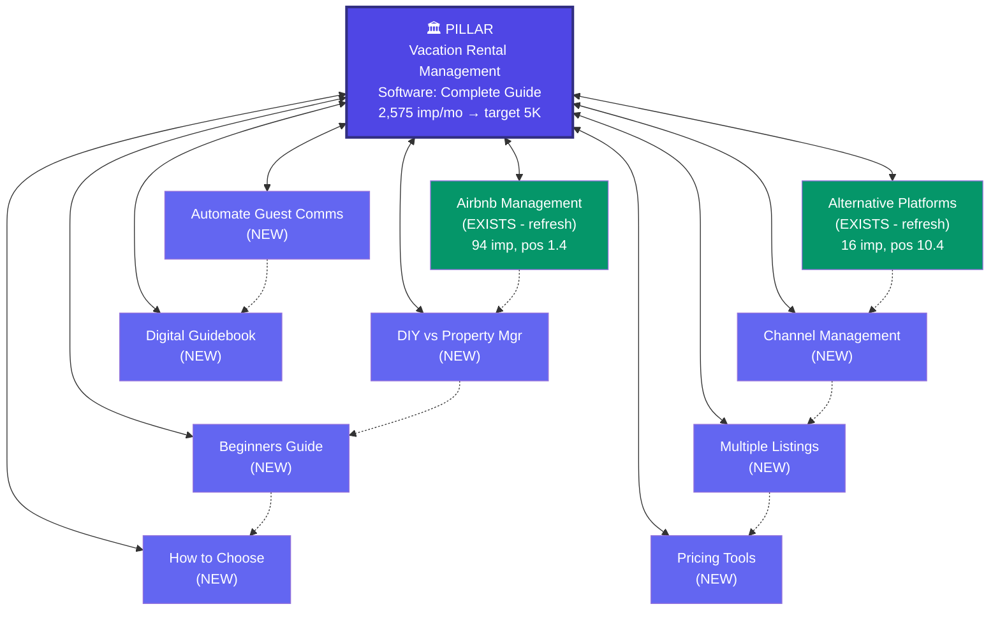
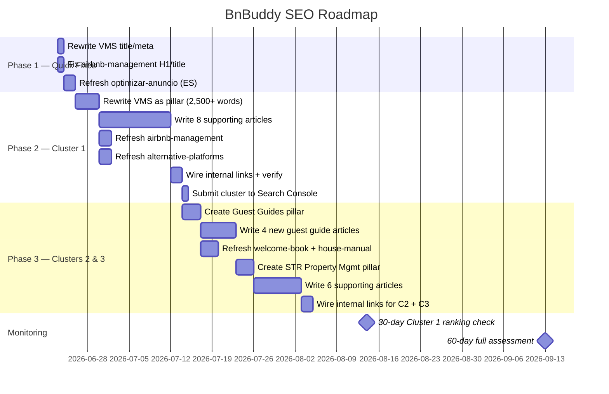
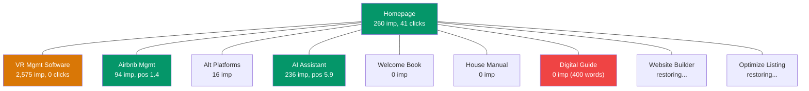
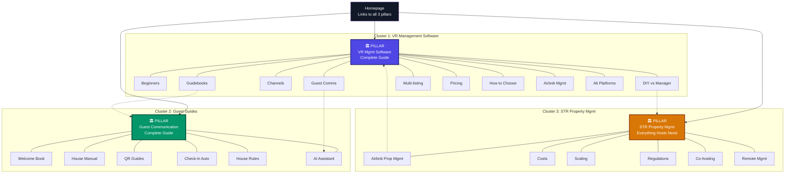

# BnBuddy SEO Roadmap: From Inventory Fixes to Topical Authority

**Date:** 2026-06-20
**Baseline:** 3,799 impressions/month, 43 clicks, 20 indexed pages
**Target:** 1,000+ organic visitors/month within 4-6 months

---

## Where We Are Today

```mermaid
graph LR
    subgraph DONE["✅ Completed (Today)"]
        A["Restored 3 deleted pages<br/>1,578 impressions recovered"]
        B["Fixed broken interlinks<br/>21 dead links removed"]
        C["Fixed year mismatches<br/>2025→2026 on 2 pages"]
        D["Added pages to sitemap<br/>3 pages now discoverable"]
    end
    
    subgraph NOW["🔴 Remaining Work"]
        E["P1: Fix CTR + declining pages"]
        F["P2: Expand thin content"]
        G["P3: Merge/archive weak pages"]
    end
    
    subgraph NEXT["🎯 Topical Clusters"]
        H["Cluster 1: VR Mgmt Software"]
        I["Cluster 2: Guest Guides"]
        J["Cluster 3: STR Property Mgmt"]
    end
    
    DONE --> NOW --> NEXT
    
    style DONE fill:#059669,color:#fff
    style NOW fill:#d97706,color:#fff
    style NEXT fill:#4f46e5,color:#fff
```



The P0 fixes are done. What remains is **16 work items across P1-P3**, but most of them fold directly into the topical cluster build. This document maps each remaining task to its cluster context so no effort is wasted on standalone fixes that will be overwritten by cluster rewrites.

---

## The Key Insight: Most Fixes Become Cluster Work

Looking at the inventory, the remaining work falls into two categories:

| Category | Items | Strategy |
|----------|-------|----------|
| **Fix now, cluster later** | CTR rewrites, title bugs, declining pages | Quick surgical fixes that improve rankings *before* the cluster amplifies them |
| **Skip standalone fix, do as part of cluster** | Thin content expansion, content refreshes | These pages will be rewritten as cluster components — fixing them twice is wasted effort |

```mermaid
graph TD
    subgraph FIX_NOW["Phase 1: Fix Now (Week 1)"]
        F1["Rewrite VMS title/meta for CTR"]
        F2["Fix airbnb-management title bug"]
        F3["Reverse optimizar-anuncio decline"]
        F4["Decide VR Property Mgmt redirect"]
    end
    
    subgraph CLUSTER_1["Phase 2: Build Cluster 1 (Weeks 2-4)"]
        C1P["Rewrite VMS as PILLAR<br/>(absorbs P1 content refresh)"]
        C1S1["Supporting: Beginner's Guide"]
        C1S2["Supporting: Automate Guest Comms"]
        C1S3["Supporting: Channel Management"]
        C1S4["Supporting: DIY vs Property Mgr"]
        C1S5["Supporting: Digital Guidebook"]
        C1S6["Supporting: Multiple Listings"]
        C1S7["Supporting: Pricing Tools"]
        C1S8["Supporting: How to Choose"]
    end
    
    subgraph CLUSTER_2_3["Phase 3: Build Clusters 2 & 3 (Weeks 5-8)"]
        C2P["Guest Guides PILLAR<br/>(absorbs thin welcome guide)"]
        C2E["Refresh welcome book +<br/>house manual<br/>(absorbs P2 expansion)"]
        C3P["STR Property Mgmt PILLAR<br/>(absorbs redirect decision)"]
    end
    
    F1 --> C1P
    F4 --> C3P
    
    style FIX_NOW fill:#d97706,color:#fff
    style CLUSTER_1 fill:#4f46e5,color:#fff
    style CLUSTER_2_3 fill:#6366f1,color:#fff
```



---

## Phase 1: Fix What's Broken (Week 1)

These are surgical fixes that take 1-2 hours each and produce immediate ranking improvements. Do them *before* starting cluster work because they improve the pages that clusters will amplify.

### 1.1 Rewrite Title/Meta for CTR on VR Management Software

| | |
|---|---|
| **Page** | [/vacation-rental-management-software/](file:///Users/albertovazquez/beto4812/bnbuddy-landing/public/vacation-rental-management-software/index.html) |
| **Problem** | 2,575 impressions/month, **0 clicks**. Title is generic: "10 Best Vacation Rental Management Software Tools (2026)" |
| **Cluster role** | This becomes the **Cluster 1 pillar page** — but even before the rewrite, a better title/meta can start capturing clicks immediately |
| **Priority** | 🔴 Highest-impact single change available |

**Current title:** `10 Best Vacation Rental Management Software Tools (2026) - BnBuddy`

**Proposed title options** (test one):
- `Best Vacation Rental Management Software (2026) — Compared by a Superhost`
- `Vacation Rental Software Comparison: 10 Tools Ranked for Hosts`
- `10 Best Vacation Rental Software Tools — From a Host Who Tested Them`

**Current meta:** `Compare the 10 best vacation rental management software tools for 2026. Find features, pricing, and pros and cons to pick the right platform for your rental.`

**Proposed meta:** `We tested 10 vacation rental management tools as active Superhosts. See real pricing, feature breakdowns, and which software actually saves you time in 2026.`

**Why this matters for Cluster 1:** This page is the pillar. If it starts getting clicks *now*, Google will boost its position. When the 8 supporting articles link to it, the pillar is already warm — the cluster effect kicks in faster.

> [!TIP]
> **Expected impact:** Even a 1% CTR on 2,575 impressions = **26 clicks/month**. A compelling title with social proof ("Superhost", "tested them") can push CTR to 3-5%, which would mean 75-130 clicks/month from this single page.

---

### 1.2 Fix Airbnb Management Page

| | |
|---|---|
| **Page** | [/airbnb-management/](file:///Users/albertovazquez/beto4812/bnbuddy-landing/public/airbnb-management/index.html) |
| **Problem** | Position **1.4** (Page 1, near #1!) with 94 impressions and **0 clicks**. Missing H1 tag. Only 1,300 words. |
| **Cluster role** | Supporting article in **Cluster 1** (VR Management Software) — will link back to the pillar |

**Work needed:**
- [ ] Add a proper `<h1>` tag (currently missing entirely)
- [ ] Verify the title tag renders correctly in SERPs (the "Joinchat" SVG doesn't affect the `<title>`, but test in Google's Rich Results Test to confirm)
- [ ] Expand from 1,300 to 2,000+ words — add real examples from your property management experience
- [ ] Add internal link to `/vacation-rental-management-software/` (future pillar)

**Why this matters for Cluster 1:** A Page 1 result with 0 clicks is a signal to Google that the result isn't useful. If they demote it, you lose your only Page 1 article page. Fixing it preserves this ranking and turns it into a cluster node.

---

### 1.3 Reverse Optimizar Anuncio Decline

| | |
|---|---|
| **Page** | [/es/optimizar-anuncio-alquiler-vacacional/](file:///Users/albertovazquez/beto4812/bnbuddy-landing/public/es/optimizar-anuncio-alquiler-vacacional/index.html) |
| **Problem** | Dropped **10.7 positions** in one period (15.9 → 26.6). 29 impressions. 1,200 words (thin). |
| **Cluster role** | Standalone Spanish article — not part of the English cluster plan, but hreflang-paired with `/optimize-vacation-rental-listing/` |

**Work needed:**
- [ ] Expand from 1,200 to 2,000+ words with specific optimization tips
- [ ] Add real examples from your own listings (screenshots of before/after listing optimization)
- [ ] Refresh the content to address current Airbnb algorithm changes
- [ ] Ensure the hreflang pair with the restored English version is working

---

### 1.4 Decide: Vacation Rental Property Management Redirect

| | |
|---|---|
| **Page** | `/vacation-rental-property-management/` → 301 to `/airbnb-management/` |
| **Problem** | Still gets 150 impressions despite being a redirect. Position 68.9 and **declining sharply** (-56% impressions, -6.6 positions). |
| **Cluster role** | This keyword cluster maps to **Cluster 3** (STR Property Management) |

**Options:**

| Option | Action | Effort | Impact |
|--------|--------|--------|--------|
| **A. Restore as its own page** | Recover from git (commit `181b50f^`), target "vacation rental property management" keywords | Medium | Separate ranking asset; can become a supporting article in Cluster 3 |
| **B. Keep redirect, optimize target** | Leave 301 in place, make `/airbnb-management/` target both keyword sets | Low | Simpler, but one page can't effectively target two different keyword intents |
| **C. Wait for Cluster 3** | Do nothing now; when Cluster 3 is built, create a dedicated page as part of the cluster | Zero | Impressions will continue declining, but effort is focused on Cluster 1 first |

**Recommendation:** Option C — the impressions are already declining and the page is at position 68.9 (Page 7). Let it go for now. When Cluster 3 is built (Phase 3), a proper page targeting these keywords will be created as part of the cluster.

---

## Phase 2: Build Cluster 1 — Vacation Rental Management Software (Weeks 2-4)

This is where the topical authority strategy begins. Cluster 1 targets BnBuddy's highest-impression topic and maps directly to your core product.

### Why Cluster 1 First

| Factor | Value |
|--------|-------|
| Existing impressions | 2,575/month (highest on the site) |
| Keyword difficulty | Moderate (72.5 position, not Page 1 yet) |
| Product alignment | BnBuddy IS vacation rental management software |
| Content exists | Pillar page already has 6,800 words of content to build on |
| Domain expertise | You're a Superhost with real management experience |

### The Pillar Page Rewrite

The existing `/vacation-rental-management-software/` page compares 10 tools but reads like a generic listicle. The rewrite should transform it into a comprehensive authority guide.

**Current structure (generic):**
```
H1: 10 Best Vacation Rental Management Software Tools (2026)
  → Tool 1: Airbnb (description, pros, cons)
  → Tool 2: Lodgify (description, pros, cons)
  → ... 8 more tools
```

**Target structure (authority):**
```
H1: Vacation Rental Management Software: The Complete Guide (2026)
  H2: What Is Vacation Rental Management Software?
    → What it does, who needs it, the problem it solves
  H2: Key Features Every Host Should Look For
    → Channel management, automated messaging, pricing tools, etc.
    → Link to Supporting Article: "How to Choose Software"
  H2: The 10 Best Tools Compared
    → Comparison table (features × tools matrix)
    → Each tool with pricing, strengths, best-for
    → Link to Supporting Article: "Best for Beginners"
  H2: How We Tested These Tools
    → Your Superhost methodology — what you actually evaluated
  H2: Beyond Software: The Full Management Stack
    → Guest communication → Link to "Automate Guest Communication"
    → Digital guidebooks → Link to "Digital Guidebooks"
    → Pricing strategy → Link to "Pricing Tools"
    → Channel management → Link to "Channel Management"
  H2: FAQs
    → Common questions with schema markup
```

> [!IMPORTANT]
> **The pillar rewrite absorbs 3 inventory items at once:**
> - P1 #5 "Content refresh — tool comparisons" → done as part of the rewrite
> - P1 #4 "Rewrite title/meta for CTR" → done as part of the rewrite
> - The page's thin SEO metadata → fixed with proper schema, FAQs, and internal links

### Supporting Articles to Write

Each supporting article is ~1,000-1,500 words and links back to the pillar.

| # | Article | Target Keyword | Links To | Absorbs Inventory Item? |
|---|---------|---------------|----------|------------------------|
| 1 | Best Vacation Rental Management Software for Beginners | vacation rental management software for beginners | Pillar + Article 8 | — |
| 2 | How to Automate Guest Communication for Your Vacation Rental | automate guest communication vacation rental | Pillar + Article 5 | — |
| 3 | Vacation Rental Channel Management: Airbnb, VRBO, and Direct Bookings | vacation rental channel management | Pillar + Article 6 | — |
| 4 | DIY Vacation Rental Management vs Hiring a Property Manager | diy vacation rental management vs property manager | Pillar + Article 1 | — |
| 5 | How to Create a Digital Guidebook for Your Vacation Rental | digital guidebook vacation rental | Pillar + Article 2 | — |
| 6 | How to Manage Multiple Airbnb Listings Without Burning Out | manage multiple airbnb listings | Pillar + Article 7 | — |
| 7 | Vacation Rental Pricing Tools and Strategies That Actually Work | vacation rental pricing tools | Pillar + Article 6 | — |
| 8 | What to Look for When Choosing Vacation Rental Software | choosing vacation rental software | Pillar + Article 1 | — |

**Existing pages that become cluster nodes** (refresh, don't rewrite from scratch):

| Page | Cluster Role | Work Needed |
|------|-------------|-------------|
| [/airbnb-management/](file:///Users/albertovazquez/beto4812/bnbuddy-landing/public/airbnb-management/index.html) | Supporting article | Add H1, expand to 2K words, link to pillar. **Absorbs P1 #9** |
| [/airbnb-alternative-platforms-for-hosts/](file:///Users/albertovazquez/beto4812/bnbuddy-landing/public/airbnb-alternative-platforms-for-hosts/index.html) | Supporting article | Expand from 800 to 1,500 words, add comparison table, link to pillar. **Absorbs P2 #10** |

### Cluster 1 Architecture



**Purple** = new pages. **Green** = existing pages to refresh and integrate.

---

## Phase 3: Build Clusters 2 & 3 (Weeks 5-8)

### Cluster 2: Airbnb Guest Guides

**Pillar:** "The Complete Guide to Airbnb Guest Communication"

This cluster absorbs the most remaining inventory items:

| Inventory Item | Absorbed How |
|---|---|
| P2 #10: Expand airbnb-house-manual (800w) | Refreshed as cluster supporting article |
| P2 #10: Expand airbnb-welcome-book-template | Refreshed as cluster supporting article |
| P3 #14: Merge or expand digital welcome guide (400w) | Merged into the new pillar page |
| P2 #11: Verify welcome book template options | Done as part of content refresh |

**Existing pages to integrate:**

| Page | Current State | Cluster Role |
|------|-------------|-------------|
| [airbnb-welcome-book-template](file:///Users/albertovazquez/beto4812/bnbuddy-landing/public/airbnb-welcome-book-template/index.html) | 5,600 words, solid | Supporting article — add link to pillar |
| [airbnb-house-manual](file:///Users/albertovazquez/beto4812/bnbuddy-landing/public/airbnb-house-manual/index.html) | 800 words, thin | Supporting article — expand to 1,500 words |
| [the-ultimate-digital-welcome-guide](file:///Users/albertovazquez/beto4812/bnbuddy-landing/public/the-ultimate-digital-welcome-guide-for-your-vacation-rental/index.html) | 400 words, too thin | **Merge into pillar** or redirect to pillar |
| [create-your-ai-assistant](file:///Users/albertovazquez/beto4812/bnbuddy-landing/public/create-your-ai-assistant-for-airbnb-in-3-easy-steps/index.html) | 800 words, Page 1 | Supporting article — expand, add link to pillar |

**New pages to write:** 3-4 supporting articles (QR code guides, house rules templates, automated check-in, digital vs printed guides)

---

### Cluster 3: Short-Term Rental Property Management

**Pillar:** "Short-Term Rental Property Management: Everything Hosts Need to Know"

This cluster absorbs:

| Inventory Item | Absorbed How |
|---|---|
| P1 #7: VR Property Management decline | The redirect target becomes part of this cluster |
| P1 #9: Fix airbnb-management page | Already integrated into Cluster 1, cross-links to Cluster 3 pillar |

**DataForSEO data already available** for 3 keywords:
- "airbnb property management" — vol: 3,600, diff: 30 (in-progress in pipeline)
- "short term rental property management" — vol: 1,000, diff: 26 (in-progress)
- "short term rental management" — vol: 1,300, diff: 77 (in-progress)

---

## How Inventory Items Map to Phases

Every remaining inventory item from the [article inventory](file:///Users/albertovazquez/.gemini/antigravity/brain/f61f967b-6b0b-4d41-bbf2-b1bcfd97ee0a/article_inventory.md) is accounted for:

| # | Inventory Item | Phase | How It's Addressed |
|---|---------------|-------|-------------------|
| 4 | Rewrite VMS title/meta for CTR | Phase 1 | Quick fix now; full rewrite in Phase 2 |
| 5 | Content refresh VMS tool comparisons | Phase 2 | Absorbed into pillar rewrite |
| 6 | Content refresh Website Builder comparisons | Phase 2 | Updated during Cluster 1 cross-linking |
| 7 | Investigate VR Property Management decline | Phase 1 | Decision: defer to Cluster 3 (Phase 3) |
| 8 | Reverse optimizar-anuncio decline | Phase 1 | Standalone Spanish fix |
| 9 | Fix airbnb-management page | Phase 1 + 2 | Quick H1 fix now; full expansion as Cluster 1 node |
| 10 | Expand thin content (3 articles) | Phase 2 + 3 | Each becomes a cluster supporting article |
| 11 | Verify welcome book templates | Phase 3 | Part of Cluster 2 content refresh |
| 12 | Update AirROI data (como-invertir) | Phase 3 | Standalone Spanish fix, low priority |
| 13 | Fix footer years | ~~P0~~ ✅ | **Already done** |
| 14 | Merge digital welcome guide | Phase 3 | Merged into Cluster 2 pillar |
| 15 | Expand guía iniciar airbnb | Phase 3 | Low priority, standalone Spanish |
| 16 | Update Metepec AirROI data | Deferred | Geo pages frozen |

---

## Timeline



---

## Current vs Target Site Architecture

### Today: Isolated Pages



All pages connect to the homepage but not to each other in any structured way. No page has enough supporting content to establish topical authority.

### Target: Three Interconnected Clusters



Three clusters, each with a pillar + 6-10 supporting articles, cross-linked between clusters where topics overlap. This is the architecture that establishes topical authority.

---

## Content That Stays Independent (Not Part of Clusters)

Some content doesn't fit into the English cluster strategy:

| Page | Status | Action |
|------|--------|--------|
| `/optimize-vacation-rental-listing/` | Restored, in sitemap | Could become Cluster 1 supporting article later |
| `/vacation-rental-website-builder/` | Restored, year fixed | Could become Cluster 1 supporting article later |
| Spanish geo pages (4) | Frozen, working cluster | No changes — already functioning |
| Spanish blog posts (4) | Mixed performance | Maintain independently; possible future Spanish clusters |
| `/es/guia-como-iniciar-en-airbnb/` | Not indexed, thin | Low priority — expand when bandwidth allows |

---

## Success Metrics

| Metric | Now (June 2026) | After Phase 1 (July) | After Phase 2 (August) | After Phase 3 (October) |
|--------|-----------------|---------------------|----------------------|------------------------|
| **Impressions** | 3,799/month | 4,500+ | 8,000+ | 15,000+ |
| **Clicks** | 43/month | 100+ | 300+ | 1,000+ |
| **CTR** | 1.1% overall | 3%+ | 5%+ | 7%+ |
| **Pages indexed** | 20 | 20 | 30 | 42 |
| **Page 1 keywords** | 2 (branded) | 4+ | 10+ | 20+ |
| **Topical clusters** | 0 (1 Spanish) | 0 | 1 complete | 3 complete |

> [!NOTE]
> **The 1,000 visitors/month milestone** (from the Aman Azad strategy) is achievable after Cluster 1 is published and indexed (~30-60 days post-publish). The math: if the pillar page moves from position 70 to position 15 and supporting articles each bring 20-50 clicks/month, the cluster collectively drives 500-1,000 visits. Clusters 2 and 3 add incremental traffic on top.
