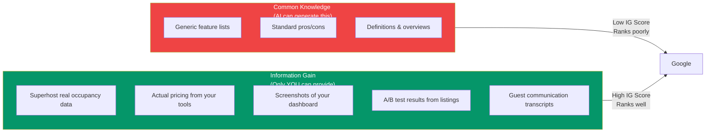
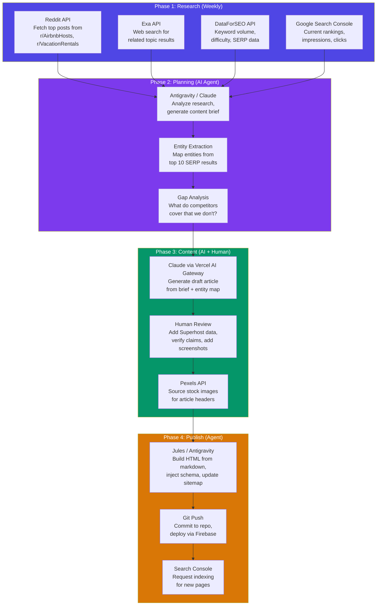
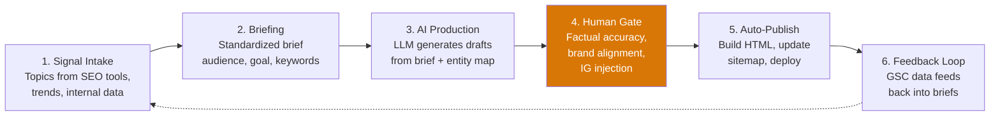

# SEO Topical Authority: Research & Automation Analysis

**Date:** 2026-06-22
**Purpose:** Validate BnBuddy's topical cluster approach, explore alternatives, and identify automation paths

---

## Part 1: Is Our Approach Validated?

### TL;DR: Yes — Strongly

The pillar-and-cluster model is the industry-standard approach in 2026, validated by Google's own algorithmic direction. The March 2026 Core Update further reinforced that Google evaluates websites as **knowledge systems** rather than collections of independent pages.

### Evidence For Topical Clusters

| Signal | Evidence |
|--------|----------|
| **Algorithm direction** | Google's Helpful Content system (now fully integrated into core ranking) evaluates domain-level expertise. Sites that "stay in their lane" consistently outperform broader, shallower sites. |
| **Traffic gains** | Industry reports show 50-300% organic traffic increases within 6-12 months for sites migrating from keyword-focused to topic-cluster models. |
| **Structural advantage** | A site with 20 interconnected articles on a subject consistently outranks a site with a single longer but isolated guide on the same topic. |
| **AI search visibility** | AI Overviews, ChatGPT, and Perplexity prioritize comprehensive, structured sources for citations. Cluster-built sites are cited more frequently. |
| **Compounding effect** | Once a domain establishes deep expertise, new content in the same topic ranks significantly faster — the "authority flywheel." |

### The HubSpot Cautionary Tale

A frequently cited 2025-2026 case study: major platforms (HubSpot-class sites) lost **75-80% of traffic in specific verticals** after publishing content that strayed too far from their core expertise. Google's systems now actively devalue even authoritative domains if they produce irrelevant content outside their demonstrated areas.

> [!TIP]
> **For BnBuddy this is good news.** We're a small site that is laser-focused on one niche (vacation rental hosting). We don't need to compete on domain authority — we compete on topical depth. A site with 30 deeply interlinked articles about vacation rental management will outrank a massive generic site with a single article on the topic.

### Criticisms and Limitations

No strategy is without critics:

| Criticism | Validity | Our Response |
|-----------|----------|--------------|
| "Clusters create keyword cannibalization" | **Valid if executed poorly.** Publishing 40 articles saying the same thing with slightly different keywords will hurt rankings. | Our plan has distinct intent per article — each supporting page answers a different user question. |
| "Internal linking doesn't matter as much as backlinks" | **Partially valid.** External links still matter, but internal links are the mechanism by which Google understands your topical structure. | Clusters give us both: the internal linking structure *and* make us more linkable (comprehensive resources attract natural backlinks). |
| "AI-generated cluster content is getting penalized" | **Valid for thin AI slop.** Google penalizes "scaled content abuse" — mass-generated content that adds no value. | Our content must include real Superhost data, proprietary insights, and product experience that AI cannot fabricate. |
| "Topic clusters are old — Google is moving to entities" | **This is an evolution, not a replacement.** Entity-based SEO is the next layer on top of clusters. | See the next section on alternative approaches. |

---

## Part 2: Alternative Approaches

Our cluster model is the foundation, but three complementary strategies can make it significantly more effective:

### 2.1 Entity-Based SEO (Enhancement, Not Replacement)

**What it is:** Instead of organizing content around keywords, organize around **entities** — the concepts, people, tools, and places that Google's Knowledge Graph associates with your topic.

**How it differs from standard clusters:**

| Standard Cluster | Entity-Based Cluster |
|-----------------|---------------------|
| "Target keyword: vacation rental management software" | "Map all entities in the 'vacation rental management' space" |
| Write articles for keyword variations | Write articles to cover every entity Google expects |
| Internal links between articles | Internal links that mirror entity relationships |
| Success = ranking for target keywords | Success = being recognized as the authoritative source for the topic entity |

**Kevin Indig's "Topic Share" metric:** Instead of tracking individual keyword rankings, measure what % of a topic's total search visibility your domain captures. A site with 15% Topic Share for "vacation rental management" is an authority; one with 0.5% is not.

> [!IMPORTANT]
> **What this means for BnBuddy:** When planning cluster articles, don't just ask "what keywords should we target?" Ask: "what entities does Google expect to see covered for 'vacation rental management software'?" If competitors cover Lodgify, Guesty, Hostaway, OwnerRez, and Hospitable — and we don't — Google sees a gap in our topical coverage.

**Action:** Before writing each cluster article, run an entity extraction on the top 10 SERP results. Cover every entity they mention, plus add entities from your own Superhost experience that they DON'T mention. This is Information Gain.

---

### 2.2 Information Gain Scoring (Critical Differentiator)

**What it is:** A Google patent concept (*Contextual estimation of link information gain*) — Google scores content based on how much **new information** it adds beyond what's already in the search index.

**Why this is existential for AI-generated content:**



**How to operationalize for BnBuddy:**

1. **Proprietary data:** Every article should include at least one data point that cannot be found elsewhere
   - "Our listings in Toluca average 80% occupancy at $X/night ADR"
   - "We tested Lodgify vs Guesty for 3 months — here's what happened to our booking rate"
   - "Here's the exact message template that gets us 100% 5-star reviews"

2. **First-person experience:** Start sections with "As a Superhost managing X properties..."

3. **Competitive gap analysis:** Before writing, check what the top 5 results say. Identify questions they leave unanswered. Answer those.

> [!CAUTION]
> **This is the single biggest risk in our current plan.** If we use AI to generate cluster articles without injecting unique data and experience, Google will treat them as "scaled content abuse." Information Gain is what makes the difference between a cluster that ranks and one that gets penalized.

---

### 2.3 Programmatic SEO (Phase 2 Scaling Tool)

**What it is:** Generating hundreds of pages from structured data using templates — e.g., "Best Vacation Rental Software for [Property Type]" × 20 property types = 20 pages.

**Verdict for BnBuddy RIGHT NOW: Don't do this yet.**

| Factor | Assessment |
|--------|-----------|
| Domain authority | Too low — we need authority before programmatic pages will rank |
| Content quality risk | High — Google's "scaled content abuse" policy specifically targets thin programmatic content |
| Data availability | We don't have structured data for hundreds of pages yet |
| Timing | After Cluster 1 is established and authority is proven (3-6 months) |

**When to use it:** Once Cluster 1 is ranking and we have established authority, we could programmatically generate comparison pages: "BnBuddy vs [Competitor]" × 15 competitors, or "Vacation Rental Management in [City]" × 30 cities. But each page must have unique data — not just template swaps.

---

## Part 3: Automation Architecture Options

### 3.1 Architecture Comparison

| Architecture | Best For | Cost | Complexity | BnBuddy Fit |
|-------------|----------|------|-----------|-------------|
| **Vercel AI Gateway + AI SDK** | Full-stack devs, Next.js apps, cost-aware routing | ~$20/mo + token costs | Medium | ✅ Good — aligns with Aman Azad workflow |
| **AWS Bedrock + Lambda + Step Functions** | Enterprise, multi-model, AWS-native teams | ~$30/mo + token costs | High | ⚠️ Overkill for current scale |
| **GCP Vertex AI + Cloud Functions** | Data-heavy pipelines, BigQuery analytics | ~$25/mo + token costs | High | ⚠️ Only if you want BigQuery analytics |
| **Agent-native (Antigravity + Jules)** | Code-first teams, GitHub-centric, existing repos | $0 infra + token costs | Low | ✅ Best fit — already using it |

### 3.2 Recommended: Hybrid Agent + API Architecture



### 3.3 Agent Role Assignment

| Agent | Role | What It Does | When |
|-------|------|-------------|------|
| **Antigravity** | Orchestrator + Content Agent | Runs research scripts, generates briefs, writes/edits content, builds HTML pages, updates sitemaps/interlinking | Primary workhorse — handles 80% of the pipeline |
| **Jules** | Technical SEO Agent | Schema markup updates, batch page fixes (like the year mismatch fix), sitemap generation, code-level optimizations | Ad-hoc technical tasks pushed via GitHub issues |
| **DataForSEO API** | Keyword Intelligence | Search volume, keyword difficulty, SERP features, competitor analysis | Called by research scripts (`npm run pull-keyword-data`) |
| **Exa API** | Web Research | Semantic search for competitor content, topic coverage analysis, information gain opportunities | Called during brief generation |
| **Google Search Console API** | Performance Monitoring | Rankings, impressions, clicks, indexing status | Called weekly (`npm run pull-ranking-data`) |
| **Vercel AI Gateway** | LLM Router | Routes content generation to cheapest capable model, cost caps, fallbacks | Optional — direct API calls work fine at current scale |
| **Pexels API** | Image Sourcing | Stock images for article headers and social cards | Called during content assembly |

### 3.4 What We Already Have vs What We Need

| Component | Status | Work Needed |
|-----------|--------|-------------|
| DataForSEO integration | ✅ Working | `pull-keyword-data.js` exists |
| Search Console integration | ✅ Working | `pull-ranking-data.js` + `compare-rankings.js` |
| Content brief generation | ✅ Working | `generate-brief.js` exists |
| Blog build pipeline | ✅ Working | `build-blog-posts.js` + `page-template.html` |
| Interlinking system | ✅ Working | `create-interlinkings.js` (just fixed) |
| Exa API integration | ❌ Not built | Need script to call Exa for topic research |
| Reddit API integration | ❌ Not built | Need script to fetch top posts from relevant subreddits |
| Entity extraction | ❌ Not built | Need script to extract entities from SERP results |
| Information Gain analysis | ❌ Not built | Need process to inject proprietary data into briefs |
| Content generation (AI) | ⚠️ Partial | Content agent instructions exist but no automated pipeline |
| Image generation/sourcing | ❌ Not built | Need Pexels API integration or AI image generation |
| Automated publishing | ⚠️ Partial | Build scripts exist, but no end-to-end automation |

---

## Part 4: Cost Analysis

### Current Stack Cost (What You're Already Paying)

| Service | Cost | Notes |
|---------|------|-------|
| DataForSEO | ~$10-20/mo | Pay-per-request, current usage is low |
| Firebase Hosting | Free tier | Under 10GB storage, under 360MB/day transfer |
| Google Search Console | Free | API access included |
| Antigravity (Gemini) | Included in IDE | No additional API cost for agent orchestration |
| Jules | Free tier | Limited to N tasks/month |

**Current total: ~$10-20/month**

### Projected Cost With Full Pipeline

| Service | Cost | Role |
|---------|------|------|
| DataForSEO | ~$20-30/mo | More keyword research for cluster planning |
| Exa API | ~$10/mo | Web research (1,000 searches/mo included free) |
| Reddit API | Free | JSON endpoints, no authentication needed |
| Pexels API | Free | 200 requests/hour, more than enough |
| Claude API (direct) | ~$15-30/mo | Content generation (~8 articles × ~3K tokens output × ~10K tokens input) |
| Vercel AI Gateway | $0 extra | Zero markup on token costs, just a routing layer |
| Firebase Hosting | Free tier | Still under limits with 30 more pages |

**Projected total: ~$50-80/month** for producing 8-12 articles/month

### Vercel AI Gateway vs Direct API vs AWS Bedrock

| Factor | Vercel AI Gateway | Direct Claude API | AWS Bedrock |
|--------|------------------|------------------|-------------|
| **Token cost** | Same as provider (zero markup) | Base pricing | Same or slightly higher |
| **Infrastructure** | Zero — serverless, included in Vercel | You manage retries, fallbacks | Lambda + Step Functions setup |
| **Cost routing** | ✅ Auto-route to cheapest model | ❌ Manual | ❌ Manual |
| **Spend caps** | ✅ Built-in budget limits | ❌ DIY | ⚠️ Via CloudWatch alarms |
| **Observability** | ✅ Dashboard included | ❌ DIY logging | ⚠️ CloudWatch + manual |
| **Setup effort** | 1 hour | 30 minutes | 4-8 hours |
| **Best for BnBuddy** | ⚠️ Nice-to-have | ✅ Simplest start | ❌ Overkill |

> [!TIP]
> **Recommendation:** Start with **direct Claude API calls** (simplest). Switch to **Vercel AI Gateway** only when you need cost routing between models (e.g., using Haiku for briefs and Sonnet for articles). Skip AWS Bedrock entirely — the operational complexity doesn't justify the benefit at BnBuddy's scale.

---

## Part 5: How This Maps to BnBuddy's Roadmap

### The Automation-Enhanced Workflow

```
Week 1: Research Phase (Automated)
├── npm run pull-ranking-data          ← Already built
├── npm run pull-keyword-data          ← Already built
├── npm run pull-reddit-research       ← TO BUILD
├── npm run pull-exa-research          ← TO BUILD
└── npm run generate-brief             ← Already built (needs entity extraction)

Week 2: Planning Phase (Agent-Assisted)
├── Antigravity: Analyze brief, map entities, identify IG opportunities
├── Human: Validate brief, add proprietary data points
└── Output: Content brief with entity checklist + IG requirements

Week 3: Writing Phase (AI + Human)
├── Antigravity: Generate draft articles from briefs
├── Human: Review, add Superhost experience, verify accuracy
├── Pexels: Source header images
└── Output: Final markdown files in content/

Week 4: Publishing Phase (Automated)
├── Antigravity/Jules: Build HTML from markdown
├── Antigravity: Update interlinkings.json, sitemap, blog index
├── Git: Commit and deploy
└── GSC: Request indexing
```

### Practical Next Steps

| # | Task | Effort | Impact |
|---|------|--------|--------|
| 1 | **Build `pull-reddit-research.js`** — Fetch top posts from r/AirbnbHosts, r/VacationRentals, r/ShortTermRentals | 2 hours | Feeds topic ideas into brief generation |
| 2 | **Build `pull-exa-research.js`** — Semantic search for competitor content on target topics | 2 hours | Identifies content gaps and entity coverage |
| 3 | **Add entity extraction to `generate-brief.js`** — Use Claude to extract entities from top SERP results | 3 hours | Ensures cluster articles cover all expected entities |
| 4 | **Create Information Gain checklist** — Document template with required proprietary data points per article | 1 hour | Forces every article to include unique, non-AI-replicable content |
| 5 | **Build content generation script** — Takes brief + entity map + IG checklist → markdown draft | 4 hours | Automates 60% of article writing; human review handles the rest |
| 6 | **Enhance build pipeline** — Auto-update interlinkings.json and sitemap when new content is added | 2 hours | Eliminates manual config work for each new article |

---

## Part 6: Key Takeaways

### What Our Research Validates

1. **Topical clusters work** — The approach is strongly validated by industry consensus, algorithm changes, and case studies. No credible evidence suggests moving away from it.

2. **Our niche focus is an advantage** — Google's systems now penalize large sites that stray from their expertise. BnBuddy's laser focus on vacation rental hosting is exactly what the algorithm rewards.

3. **Information Gain is the differentiator** — The biggest risk is producing generic AI content that adds nothing to the index. Every article must include proprietary data, Superhost experience, or analysis that competitors don't have.

4. **Entity coverage matters more than keyword targeting** — Don't just pick keywords; map the entire entity space for each cluster topic and ensure comprehensive coverage.

### What We Should Change

1. **Add entity extraction to the brief generation process** — Before writing any cluster article, extract entities from the top 10 SERP results and build a coverage checklist.

2. **Create an Information Gain requirement** — Every article brief must specify at least 2-3 proprietary data points or unique insights that must be included.

3. **Skip Vercel AI Gateway and AWS Bedrock for now** — Direct API calls are simpler and cheaper at our scale. Revisit when monthly content volume exceeds 20 articles.

4. **Use Antigravity as the primary pipeline agent** — It already has access to the codebase, can run scripts, edit files, and orchestrate the full pipeline. Jules handles technical SEO tasks via GitHub.

### What We Should NOT Do

- ❌ **Don't mass-generate content** — 8 high-quality articles/month > 30 thin ones
- ❌ **Don't skip human review** — AI drafts + human validation is the winning formula
- ❌ **Don't over-engineer the pipeline** — We need scripts, not a Kubernetes cluster
- ❌ **Don't forget the math** — 1,000 visitors = ~15-20 articles × 50-70 clicks each. Quality beats quantity.

---

## Part 7: Automation Deep Dive (Agent & Platform Research)

### 7.1 ShipGTM / Aman Azad — The Vercel Workflow Approach

**ShipGTM** (shipgtm.com, shipgtm.substack.com) is the team behind the "Speedrun to 1,000 Visitors" strategy. Key people:
- **Aman Azad** — Former founder/CTO, now Software Engineer for GTM at Vercel
- **Cameron Youngblood** — Software Engineer in GTM at Vercel
- **Bridger Tower** — AI and design engineer

**Key project: Draft.town** — An RPG-style system for managing SEO clusters and generating ranking content.

**Their pipeline pattern:**
1. Identify high-intent clusters (1 pillar + 5-10 cluster pages)
2. Automate research, outline generation, and crawl error monitoring using **Vercel Workflow SDK**
3. Pillar-cluster internal linking (every cluster links to pillar, pillar links to clusters)
4. Continuous optimization (regular refreshes, filling gaps as user intent evolves)

**Follow:** [ShipGTM Substack](https://shipgtm.substack.com) | [YouTube @shipgtm](https://youtube.com/@shipgtm)

### 7.2 Vercel Workflow SDK — Durable AI Pipelines

The Vercel Workflow SDK enables **durable, resumable, observable** long-running processes — ideal for content pipelines that need human review checkpoints:

```
Research (Tool-Driven)
  → AI pulls data from external APIs using custom tools
  → Stores results in structured object
  
Drafting (Constrained Generation)
  → `generateObject` with strict `zod` schema
  → Forces specific sections: Intro, Body, FAQ, Metadata
  
Validation
  → Tools verify keyword density, internal links, schema markup
  → Failures trigger retries or human flags
  
Human Approval
  → Workflow SUSPENDS execution
  → Waits for human approval via admin dashboard
  → RESUMES publishing after approval
```

**Key insight from ShipGTM:** "Let the LLM handle the 30% that is creative (writing), while using code-based logic for the 70% that is mechanical (research, formatting, SEO checks)."

**Links:** [Vercel AI SDK docs](https://sdk.vercel.ai/) | [Workflow SDK on GitHub](https://github.com/vercel/workflow)

### 7.3 Open-Source SEO Agent Projects

| Project | Description | Relevance |
|---------|-------------|-----------|
| **Agent-Writer** (`gregorym/agent-writer`) | Full lifecycle: keyword research → AI content → scheduling → publishing to Ghost/GitHub (PRs) | Closest match to what we need |
| **N8N ViralFlow** (`PrabhanshuKamal2121/N8N-ViralFlow`) | Template for automated content workflows | Good reference for workflow design |
| **CrewAI / LangGraph** | Multi-agent orchestration frameworks | Overkill for our scale, but useful patterns |
| **POSIMYTH/ai-seo** | WordPress AI SEO plugins, `llms.txt` generation | Useful for the `llms.txt` pattern |

### 7.4 AI Coding Agents Compared for SEO Pipelines

| Agent | Best For | Limitation |
|-------|----------|------------|
| **Antigravity (Gemini)** | Orchestration — reads codebase, runs scripts, edits files, generates content | Requires interactive session |
| **Jules (Google)** | Async technical tasks — creates PRs independently, excels at structured data/JSON | Creative writing is weaker |
| **Claude Code** | Creative writing — natural prose, tone consistency | Different ecosystem |
| **Cursor** | MCP server integration, pulling live SEO data into IDE | IDE-bound, not for pipelines |

> [!TIP]
> **Our current split is industry-aligned:** Jules for Monday data tasks (structured, JSON-heavy), Antigravity/Claude for content writing (creative, needs nuance). This maps to the ShipGTM principle of splitting structured data vs. creative writing across different models.

### 7.5 New Recommendations from Automation Research

#### Add `llms.txt` to bnbuddy.com

With AI Overviews and LLM-powered search engines (Perplexity, ChatGPT search) becoming major traffic sources, add an `llms.txt` file to help AI crawlers understand your site:

```
# BnBuddy — AI Guest Assistant for Vacation Rental Hosts
> SaaS platform for vacation rental hosts providing AI guest communication, digital guidebooks, and direct booking portals.

## Core Product Pages
- /create-your-ai-assistant-for-airbnb-in-3-easy-steps/: Step-by-step guide to setting up AI guest assistant
- /vacation-rental-management-software/: Comprehensive comparison of 10 management tools

## Blog Content
- /airbnb-welcome-book-template/: Comparison of welcome book templates
- /airbnb-house-manual/: Guide to creating house manuals
...
```

#### Consider Exa AI or Tavily for Research Agent

| Tool | Strength | Cost |
|------|----------|------|
| **Exa AI** | Finds concepts, not just keywords. Semantic search ideal for "what are hosts struggling with?" | 1,000 searches/mo free |
| **Tavily** | Source-first discovery, citation-ready output optimized for LLMs | Paid |
| **Firecrawl** | End-to-end "find → extract → clean" for web research | Paid |

#### Reddit Research Tools

- **GummySearch** — Community-specific keyword mining from subreddits
- **Keyworddit** — Extract keyword ideas from subreddit discussions
- **F5Bot** — Real-time email alerts for brand/topic mentions
- Best approach: `site:reddit.com [topic]` in Google → feed URLs into AI for synthesis

### 7.6 Content Quality Safeguards

#### Google's Stance on AI Content (June 2026)

Google does NOT penalize AI-generated content per se. It penalizes:
- Mass-produced, low-originality content
- Content that fails to satisfy user intent
- Content designed primarily to manipulate rankings
- Missing human author attribution or verifiable expertise

#### The Six-Stage Pipeline (Industry Best Practice)



> [!IMPORTANT]
> **Stage 4 (Human Gate) is non-negotiable.** This is where you add proprietary data, verify factual claims, and inject the Superhost experience that makes content rank. Skip this and you're producing commodity content that Google will suppress.

#### Designing for AI Citations (Not Just Clicks)

The goal is no longer just "rank on Google" — it's to become a **cited source** in AI answers:
- Use structured data (`schema.org`, JSON-LD) on every article
- Include clear, bolded **direct answers** (40-50 words) at the start of each section
- Add named expert attribution with real credentials
- Add `llms.txt` and `ai.txt` for AI crawler optimization
- Factual, evidence-based statements that AI systems can verify

### 7.7 Headless CMS Options (If We Outgrow Git-as-CMS)

| CMS | Best For BnBuddy? | Why |
|-----|-------------------|-----|
| **Payload** | ✅ Best fit | Native Next.js integration, code-first schema, self-hosted |
| **Sanity** | ⚠️ Good option | Flexible schemas, GROQ queries, but hosted service |
| **Strapi** | ⚠️ Good option | Open-source, self-hosted, no API limits |
| **Current approach (Git + Markdown)** | ✅ Fine for now | Aligned with how top teams operate, no cost |

> [!NOTE]
> Our current "Git-as-CMS" approach (markdown → build script → HTML) is perfectly aligned with industry best practices. Teams at Vercel and Netlify use this pattern. Only consider a headless CMS when content volume or non-technical contributors require a visual editing interface.

