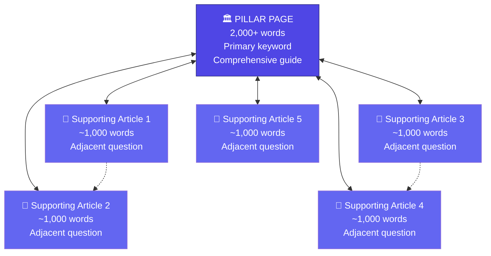
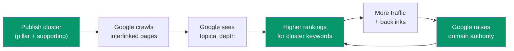
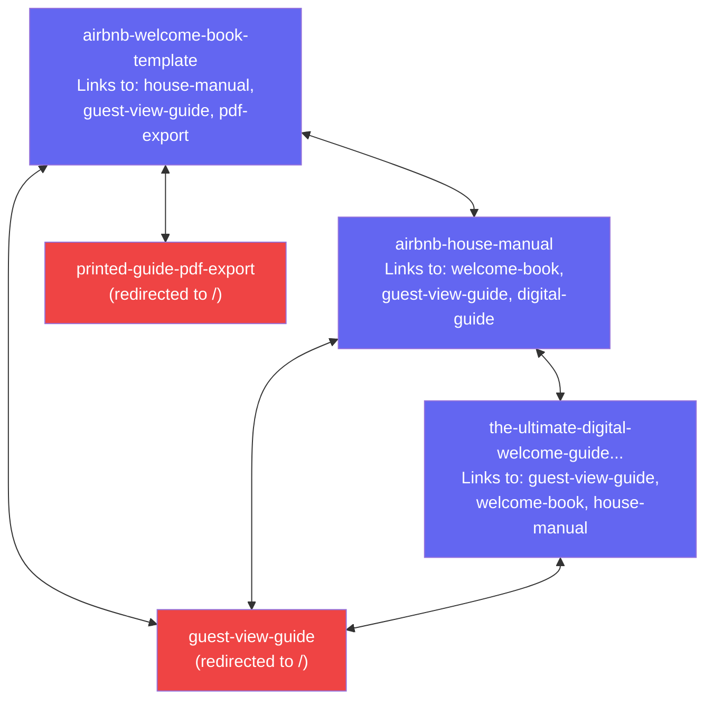
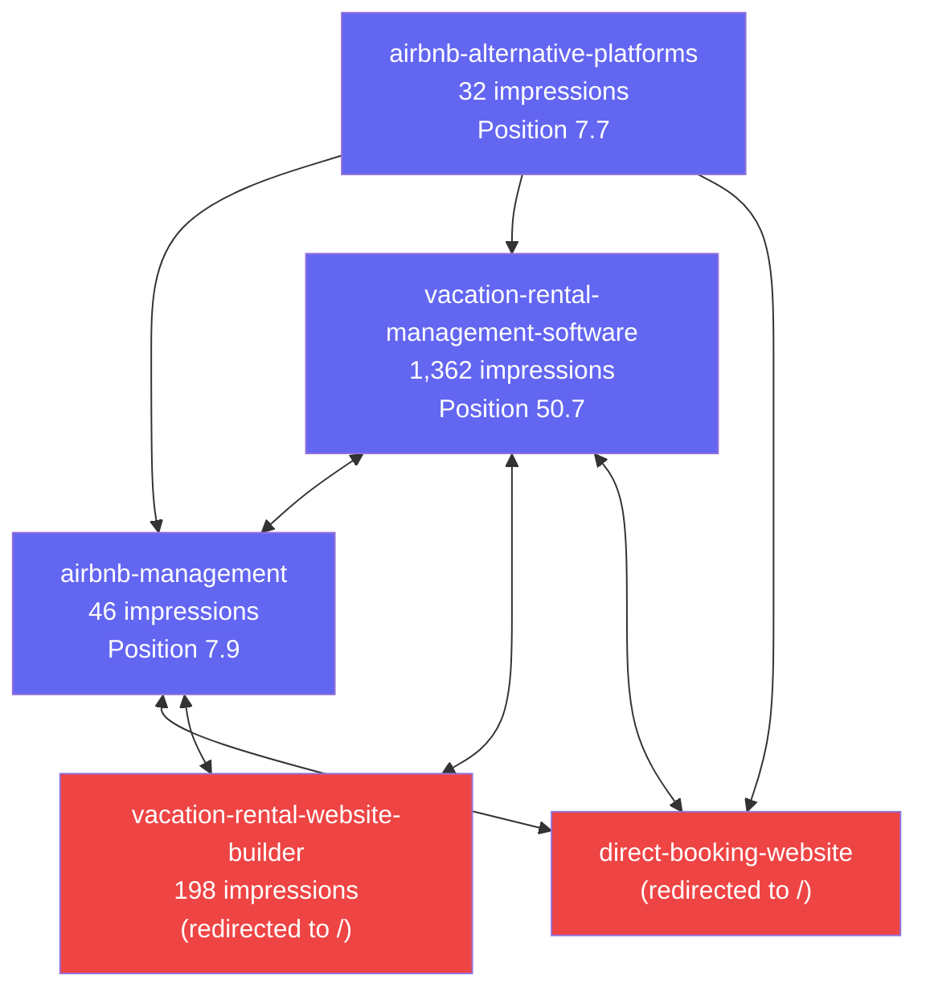
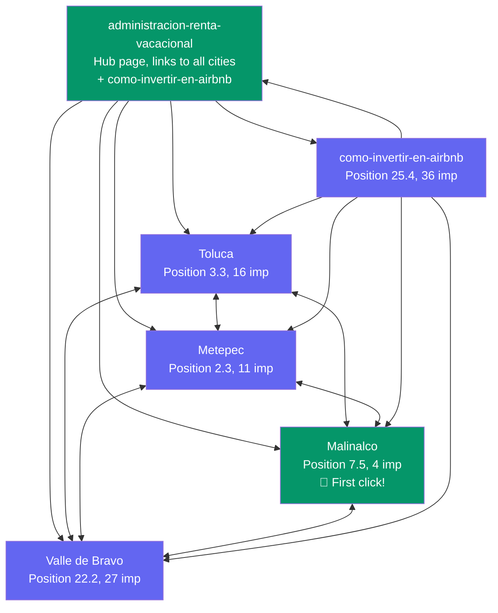
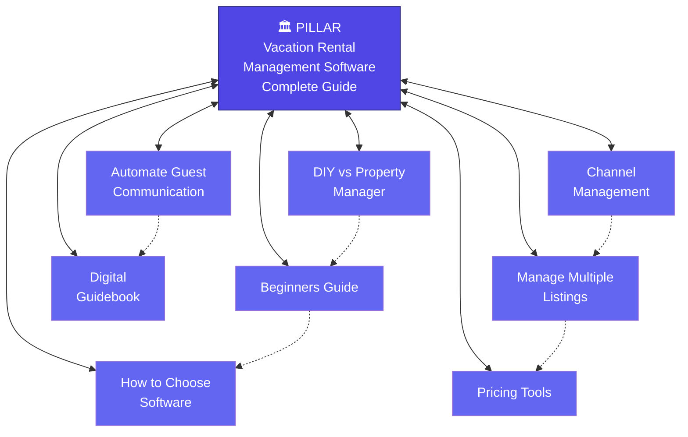
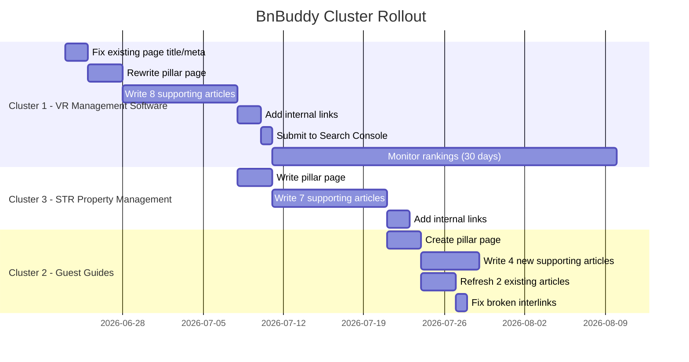

# SEO Topical Clusters: How They Work & How to Apply Them to BnBuddy

**Date:** 2026-06-20
**Context:** Strategy document for building topical authority on [bnbuddy.com](https://bnbuddy.com)

---

## What Is a Topical Cluster?

A topical cluster is an SEO content architecture where one **pillar page** (a comprehensive, long-form piece targeting a primary keyword) is surrounded by multiple **supporting articles** (shorter, focused pieces targeting adjacent keywords). Every piece links to the others.

The goal: convince Google that your site is the definitive authority on one specific topic.



**Solid lines** = mandatory links (pillar ↔ supporting). **Dotted lines** = optional cross-links between related supporting articles.

---

## Why Topical Clusters Work

### The Problem with Standalone Articles

Publishing isolated blog posts is like shouting random facts into a crowded room. Google sees each page independently. No single page has enough depth to outrank established competitors, and Google has no reason to view your site as an authority on anything.

This is where BnBuddy is today — **15 indexed pages, 2,517 impressions/month, but the pages aren't connected into clusters.** Google knows bnbuddy.com exists but doesn't yet consider it an authority on any specific topic.

### How Google Evaluates Authority

Google uses several signals to decide if a site is authoritative on a topic:

| Signal | What Google Looks For | How Clusters Help |
|--------|----------------------|-------------------|
| **Topical depth** | Multiple pages covering the same topic from different angles | The cluster itself — 1 pillar + 5-10 supporting articles |
| **Internal linking** | Pages link to each other with relevant anchor text | Pillar ↔ supporting links tell Google "these pages are about the same topic" |
| **Semantic coverage** | Content addresses the full range of questions a searcher might have | Supporting articles cover every sub-question |
| **E-E-A-T** | Experience, Expertise, Authority, Trust | Your real hosting experience (Superhost, 100% 5-star reviews) adds credibility |
| **Crawl structure** | Clear URL hierarchy and sitemap signals | `/blog/vacation-rental-management/` prefix groups content |

### The Flywheel Effect

Once a cluster starts ranking, it creates a compounding loop:



> [!TIP]
> **This is why clusters beat individual articles.** A single great article might rank #30 for one keyword. But a cluster of 8 interlinked articles on the same topic can push the pillar page from #30 to Page 1 — because Google now trusts that your site *owns* this topic.

---

## Anatomy of a Cluster

### The Pillar Page

The pillar is your comprehensive, authoritative guide. Think of it as the table of contents for the topic.

**Requirements:**
- **Length:** 2,000+ words minimum
- **Keyword:** High-traffic primary keyword (validated via DataForSEO)
- **Structure:** H1 matching the keyword, H2s covering every major subtopic, H3s for details
- **Internal links:** Links out to every supporting article in the cluster
- **Goal:** After reading, the visitor should be a near-expert on the topic

**Example for BnBuddy:**
> **Pillar: "Vacation Rental Management Software: The Complete Guide for Hosts"**
> 
> This page would cover what VR management software does, who needs it, how to evaluate options, key features to look for, pricing models, and how it fits into a host's workflow. Each H2 section would link to a dedicated supporting article that goes deeper.

### Supporting Articles

Each supporting article targets one specific sub-question that the pillar mentions but doesn't deep-dive into.

**Requirements:**
- **Length:** ~1,000 words each
- **Keyword:** Adjacent keyword (lower volume is fine — these are about coverage, not traffic individually)
- **Structure:** H1 matching the keyword, practical and specific
- **Internal links:** Links back to the pillar page + optionally to 1-2 related supporting articles
- **Goal:** Deep dive on one angle. A visitor who wanted more detail on that specific sub-topic gets their answer.

### Internal Linking Rules

This is the mechanism that makes clusters work. Without proper linking, you just have a collection of loosely related articles — not a cluster.

| Rule | Why |
|------|-----|
| **Every supporting article MUST link back to the pillar** | Passes link equity to the pillar; tells Google these pages are related |
| **The pillar MUST link out to every supporting article** | Creates a hub-and-spoke crawl path; Google discovers all pages from the pillar |
| **Use descriptive anchor text** | Don't use "click here." Use the target article's keyword as the link text |
| **Supporting articles CAN cross-link to each other** | Only when topically relevant; don't force it |
| **Don't link outside the cluster from supporting articles** | Keep link equity flowing within the cluster; external links go in the pillar |

```
Anchor text examples:

✅ "Learn more about automating guest communication for your vacation rental"
   → links to supporting article about guest communication automation

❌ "Click here to learn more"
   → tells Google nothing about what the linked page is about

✅ "If you're comparing vacation rental management software options, 
    see our complete guide"
   → links back to the pillar from a supporting article
```

---

## BnBuddy's Current State: An Accidental Cluster Audit

Your existing English content already forms **two informal clusters** — they just aren't properly linked or structured as clusters.

### Cluster Signal 1: Guest Guides & Welcome Books

These pages are semantically related and even have interlinking configured in [interlinkings.json](file:///Users/albertovazquez/beto4812/bnbuddy-landing/interlinking/interlinkings.json):



> [!WARNING]
> **Problem:** Two of the interlinked pages (`guest-view-guide` and `printed-guide-pdf-export`) are 301-redirected to the homepage in [firebase.json](file:///Users/albertovazquez/beto4812/bnbuddy-landing/firebase.json). So the interlinking map points to dead ends. These links dilute the cluster and confuse Google.

**What's missing:** No pillar page. These are all supporting-level articles that link to each other but don't have a central hub. There's no "Digital Guest Guides: The Complete Guide" page that ties everything together.

### Cluster Signal 2: Management & Tools

These pages are also interlinked:



> [!WARNING]
> **Same problem:** `vacation-rental-website-builder` and `direct-booking-website` are both 301-redirected to `/`. So 2 of the 5 nodes in this cluster are broken. The highest-impression page (VMS at 1,362/month) links to two dead pages.

### Cluster Signal 3: Spanish Geo Pages (Already Working)

Your Spanish geo pages are actually the closest thing to a functioning cluster:



This cluster is **properly structured**: hub page links to all cities, all cities cross-link to each other, and the investment article links back to everything. This is why Malinalco got its first click and the geo pages are steadily ranking.

**The lesson:** The interlinking structure you already have for Spanish geo pages is exactly the pattern to replicate for English topical clusters.

---

## Three Proposed Clusters for BnBuddy

### Cluster 1: Vacation Rental Management Software
*Highest priority — you already have 1,362 impressions/month on this topic*

**Why this cluster:**
- Existing page at `/vacation-rental-management-software/` already gets the most impressions on the entire site
- Position 50.7 means Google recognizes the page but doesn't yet trust it enough for Page 1
- "vacation rental management software for beginners" is already at position **5.6** (Page 1!)
- Adding 8 supporting articles will signal to Google that bnbuddy.com is the authority on this topic
- This cluster maps directly to BnBuddy's product (your software IS vacation rental management software)

**Pillar Page:** Vacation Rental Management Software: The Complete Guide for Hosts
- **Target keyword:** "vacation rental management software" (search volume: varies, difficulty: moderate)
- **URL:** `/vacation-rental-management-software/` (already exists — needs rewrite as pillar)
- **Length:** 2,500+ words
- **Product tie-in:** BnBuddy IS this product — showcase your AI guest assistant, guidebooks, and direct booking portal as concrete examples

**Supporting Articles:**

| # | Headline | Target Keyword | Why This Article | Product Tie-In |
|---|----------|---------------|------------------|----------------|
| 1 | Best Vacation Rental Management Software for Beginners | vacation rental management software for beginners | Already position 5.6 — a dedicated article could hit #1 | BnBuddy as the beginner-friendly option |
| 2 | How to Automate Guest Communication for Your Vacation Rental | automate guest communication vacation rental | Core pain point hosts face; Reddit r/AirBnB top topic | AI Guest Assistant feature |
| 3 | Vacation Rental Channel Management: Airbnb, VRBO, and Direct Bookings | vacation rental channel management | Adjacent concern for anyone evaluating software | Direct Booking Portal feature |
| 4 | DIY Vacation Rental Management vs Hiring a Property Manager | diy vacation rental management vs property manager | Decision-stage question your customers ask | BnBuddy as the DIY enabler |
| 5 | How to Create a Digital Guidebook for Your Vacation Rental | digital guidebook vacation rental | Unique to BnBuddy — few competitors cover this well | Digital Guidebooks feature |
| 6 | How to Manage Multiple Airbnb Listings Without Burning Out | manage multiple airbnb listings | Scaling pain point; high Reddit engagement | Multi-property dashboard |
| 7 | Vacation Rental Pricing Tools and Strategies That Actually Work | vacation rental pricing tools | Adjacent topic that software users care about | Integration / future feature |
| 8 | What to Look for When Choosing Vacation Rental Software | choosing vacation rental software | Comparison/evaluation intent — catches bottom-funnel traffic | Feature comparison positioning |

**Internal Linking Map:**



---

### Cluster 2: Airbnb Guest Guides
*You already have 3 articles on this topic — formalize the cluster*

**Why this cluster:**
- Three existing articles (`airbnb-welcome-book-template`, `airbnb-house-manual`, `the-ultimate-digital-welcome-guide...`) are already indexed
- This is BnBuddy's most differentiated product feature — Digital Guidebooks with QR codes
- Low competition — most competitors focus on PMS features, not guest guides
- Two of the interlinked pages are dead (redirected) — fixing this alone will help

**Pillar Page:** The Ultimate Guide to Airbnb Guest Communication: From Welcome Books to AI Assistants
- **Target keyword:** "airbnb guest communication" or "airbnb welcome guide"
- **URL:** `/airbnb-guest-guide/` (new page, or upgrade the existing `the-ultimate-digital-welcome-guide...`)
- **Length:** 2,500+ words

**Supporting Articles (existing + new):**

| # | Headline | Status | Notes |
|---|----------|--------|-------|
| 1 | Airbnb Welcome Book Template: What to Include and Free Examples | ✅ Exists | Needs refresh + link back to pillar |
| 2 | Airbnb House Manual: The Complete Checklist for Hosts | ✅ Exists | Needs refresh + link back to pillar |
| 3 | Digital vs Printed Welcome Books: Which Is Better for Guests? | 🔴 New | BnBuddy advantage — digital guidebooks |
| 4 | How to Create a QR Code Guide for Your Vacation Rental | 🔴 New | Unique BnBuddy feature |
| 5 | Airbnb House Rules Template: Examples That Actually Get Read | 🔴 New | Common question, linked to house manuals |
| 6 | How to Automate Check-In Instructions for Airbnb | 🔴 New | Connects to AI Guest Assistant |
| 7 | Best Tools for Creating Digital Guest Guides in 2026 | 🔴 New | Comparison post — BnBuddy featured |

---

### Cluster 3: Short-Term Rental Property Management
*Aligned with your latest research brief — 3 keywords already queued*

**Why this cluster:**
- Your [latest brief](file:///Users/albertovazquez/beto4812/bnbuddy-agents/pipelines/seo-content-pipeline/data/briefs/research-brief-2026-05-06.json) already identified 3 brand-aligned keywords:
  - "airbnb property management" — vol: 3,600, diff: 30, brand_relevance: 1
  - "short term rental property management" — vol: 1,000, diff: 26, brand_relevance: 1
  - "short term rental management" — vol: 1,300, diff: 77, brand_relevance: 1
- The existing page `/vacation-rental-property-management/` has 195 impressions but is declining (31.3 → 50.8 over 4 weeks)
- A cluster would reverse this decline by adding supporting content that reinforces the pillar

**Pillar Page:** Short-Term Rental Property Management: Everything Hosts Need to Know
- **Target keyword:** "short term rental property management" (vol: 1,000, diff: 26)
- **URL:** `/short-term-rental-property-management/` (new, or redirect the declining page)
- **Length:** 2,500+ words

**Supporting Articles:**

| # | Headline | DataForSEO Data | Notes |
|---|----------|----------------|-------|
| 1 | Airbnb Property Management: Self-Manage or Hire Help? | vol: 3,600, diff: 30 | Already in-progress in content pipeline |
| 2 | Short-Term Rental Management: A Beginner's Complete Guide | vol: 1,300, diff: 77 | In-progress — high difficulty, but cluster will help |
| 3 | How Much Does Airbnb Property Management Cost? | Research needed | High commercial intent |
| 4 | How to Scale from 1 to 10 Short-Term Rental Properties | Research needed | Growth-stage host question |
| 5 | Short-Term Rental Regulations: What Hosts Need to Know | Research needed | Compliance concern, high search interest |
| 6 | Airbnb Co-Hosting: How It Works and When It Makes Sense | Research needed | Maps to BnBuddy's co-hosting service |
| 7 | Remote Vacation Rental Management: Tools and Best Practices | Research needed | Software-oriented, product tie-in |

---

## Cluster Rollout Plan

### Priority Order

| Order | Cluster | Rationale |
|-------|---------|-----------|
| **1st** | Vacation Rental Management Software | Highest existing impressions (1,362/mo). Already has a page. Biggest potential for quick ranking gains. |
| **2nd** | Short-Term Rental Property Management | 3 keywords already queued in the pipeline with DataForSEO data. Reverses a declining page. |
| **3rd** | Airbnb Guest Guides | 3 articles already exist. Lower effort to formalize. But lower search volume potential. |

### Timeline



---

## How This Connects to the Vercel Workflow

The topical cluster strategy is the **content strategy**. The [Vercel Workflow from the readiness assessment](file:///Users/albertovazquez/.gemini/antigravity/brain/f61f967b-6b0b-4d41-bbf2-b1bcfd97ee0a/readiness_assessment.md) is the **execution engine**.

Here's how they map:

| Workflow Step | Cluster Application |
|--------------|-------------------|
| Reddit + Exa research | Discovers what questions hosts are asking about the cluster topic right now |
| Claude generates pillar keywords | Identifies the pillar keyword from fresh research data |
| DataForSEO expands keywords | Validates volume + difficulty for the pillar and all supporting keywords |
| Claude picks pillar keyword | Selects the best pillar from the DataForSEO results |
| Claude generates supporting headlines | Creates the 5-10 supporting article topics |
| **Article loop** | Writes each piece in the cluster — pillar first, then supporting articles |
| Sanity CMS publish | Stores all articles as drafts for review before publishing |

**One workflow run = one complete cluster.**

The workflow produces the raw content. Your job is to:
1. Review the drafts in Sanity
2. Add your domain expertise (real examples, product screenshots, Superhost insights)
3. Ensure internal links are correct (pillar ↔ supporting)
4. Publish

---

## Key Principles to Remember

### 1. Depth Over Breadth
Don't write 30 articles on 30 different topics. Write 8-10 articles on ONE topic. Own that topic completely before moving to the next cluster.

### 2. Internal Linking Is Not Optional
Without internal links, you just have a blog. The links are what make it a cluster. Google's crawler follows links to understand relationships between pages. No links = no relationship signal.

### 3. The Pillar Gets the Traffic, Supporting Articles Get the Authority
Most of your organic traffic will come through the pillar page. The supporting articles exist primarily to boost the pillar's rankings by adding topical depth. Some supporting articles will rank on their own for long-tail keywords — that's a bonus.

### 4. Your POV Is the Moat
AI can generate 10,000 words in a minute. What AI can't do is share that you're a Superhost with 100% 5-star reviews and 80%+ occupancy. Your real-world experience running vacation rentals in Toluca and Metepec is what makes BnBuddy's content impossible to replicate. Inject this into every article.

### 5. Fix CTR Before Adding Volume

> [!IMPORTANT]
> Your #1 quick win right now isn't more content — it's fixing click-through rates on pages that already get impressions.
> 
> | Page | Impressions | Clicks | CTR |
> |------|------------|--------|-----|
> | /vacation-rental-management-software/ | 1,362 | 0 | 0% |
> | /vacation-rental-website-builder/ | 198 | 0 | 0% |
> | /vacation-rental-property-management/ | 195 | 0 | 0% |
> 
> A 2% CTR on those 1,362 impressions = **27 clicks/month** — from a title tag change alone. Do this before publishing new cluster content.

### 6. 30-Day Patience Rule
After publishing a cluster, Google needs time to crawl, index, and evaluate. Expect **30 days minimum** before seeing ranking movement. Don't panic-edit or unpublish during this window.

---

## Immediate Action Items

- [ ] **Fix broken interlinks** — Remove `guest-view-guide`, `printed-guide-pdf-export`, `direct-booking-website`, and `vacation-rental-website-builder` from [interlinkings.json](file:///Users/albertovazquez/beto4812/bnbuddy-landing/interlinking/interlinkings.json) since they all 301 to `/`
- [ ] **Rewrite title tags** on the top 3 impression pages (0% CTR is leaving traffic on the table)
- [ ] **Decide which cluster to build first** (recommendation: Cluster 1 — VR Management Software)
- [ ] **Define the exact supporting headlines** — run them through DataForSEO to validate volume/difficulty
- [ ] **Update [english-posts.json](file:///Users/albertovazquez/beto4812/bnbuddy-landing/interlinking/english-posts.json)** — remove dead pages, add cluster structure
