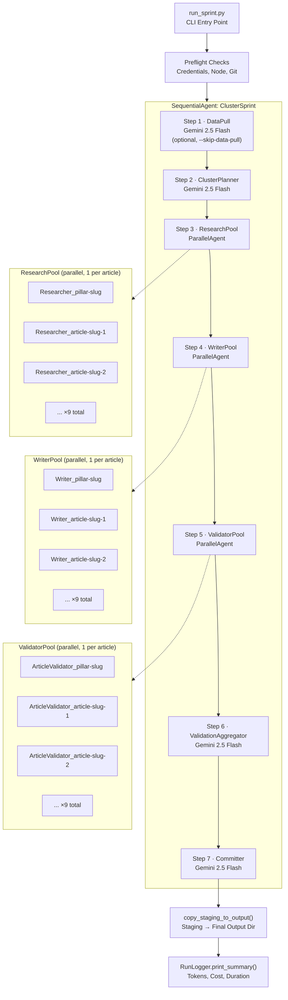
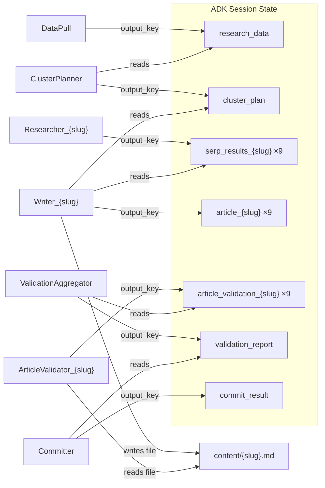
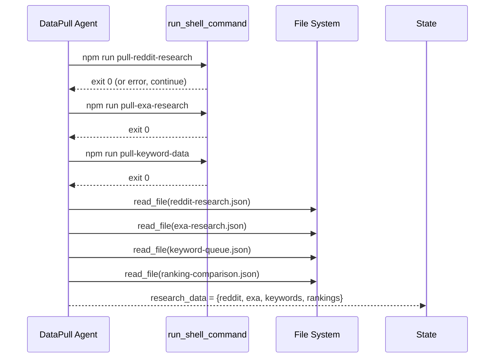
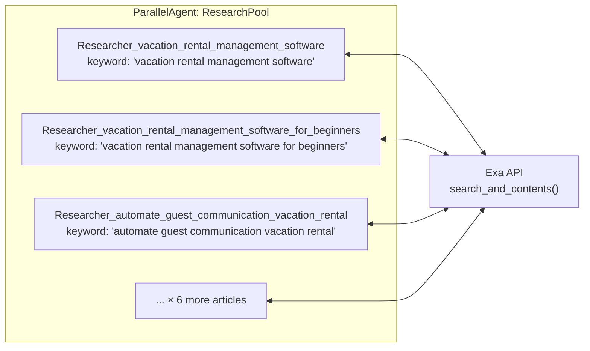
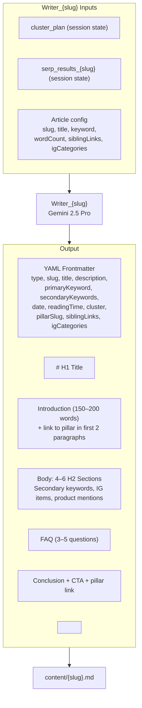
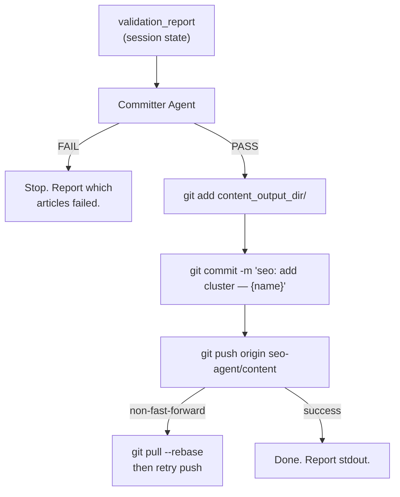
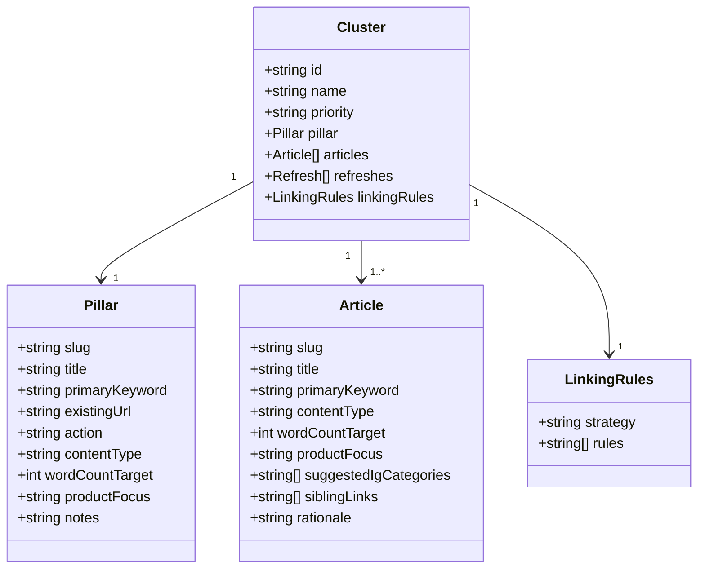
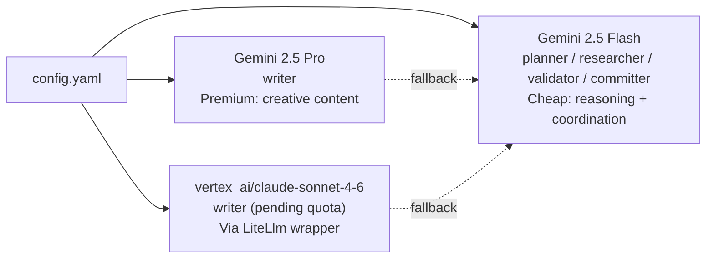
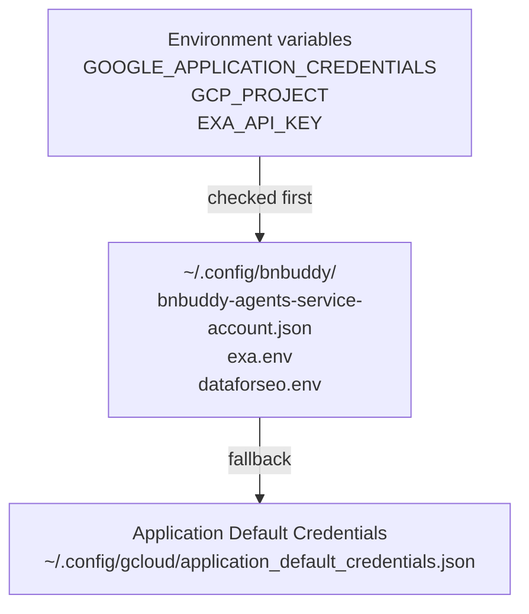

# SEO Content Pipeline v2

Cluster-based SEO content generation powered by [Google ADK](https://adk.dev) (Agent Development Kit). Produces an entire topical cluster — 1 pillar page + 8 supporting articles — in a single automated sprint.

---

## Table of Contents

- [Overview](#overview)
- [Pipeline Architecture](#pipeline-architecture)
- [Session State & Data Flow](#session-state--data-flow)
- [Agents In Detail](#agents-in-detail)
  - [DataPull](#1-datapull)
  - [ClusterPlanner](#2-clusterplanner)
  - [ResearchPool](#3-researchpool)
  - [WriterPool](#4-writerpool)
  - [ValidatorPool](#5-validatorpool)
  - [ValidationAggregator](#6-validationaggregator)
  - [Committer](#7-committer)
- [Tools](#tools)
- [Cluster Definition Schema](#cluster-definition-schema)
- [Information Gain (IG) System](#information-gain-ig-system)
- [Model Routing](#model-routing)
- [Credentials & Pre-flight](#credentials--pre-flight)
- [Run Logging](#run-logging)
- [Directory Structure](#directory-structure)
- [Quick Start](#quick-start)
- [Adding a New Cluster](#adding-a-new-cluster)
- [Relationship to v1 Pipeline](#relationship-to-v1-pipeline)

---

## Overview

The pipeline takes a pre-planned **cluster definition** (JSON file) and autonomously produces a complete content cluster optimized for topical authority. Each sprint:

1. Pulls fresh SEO research data from Reddit, Exa, and DataForSEO
2. Enriches the cluster plan with outlines, secondary keywords, and IG assignments
3. Researches the SERP competition for every article simultaneously
4. Writes all articles in parallel
5. Validates each article against quality standards
6. Commits the validated content to git

---

## Pipeline Architecture

The root agent is a `SequentialAgent` (`ClusterSprint`) that chains 7 steps. Steps 3–5 use `ParallelAgent` internally, so all articles within each step run concurrently.



---

## Session State & Data Flow

All agents communicate through **ADK session state** — a shared key/value store. Agents write to state via `output_key` and read from it via `{{key}}` template substitution in their prompts.



**State keys pre-seeded at startup** (to avoid ADK `KeyError` on missing template keys):
- `cluster_config` — serialized cluster JSON
- `cluster_plan` — `"(Cluster plan pending)"`
- `validation_report` — `"(Validation pending)"`
- `serp_results_{slug}` — `"(SERP research pending)"` for each article
- `article_validation_{slug}` — `"(Validation pending)"` for each article

---

## Agents In Detail

### 1. DataPull

**Model:** Gemini 2.5 Flash  
**Tools:** `run_shell_command`, `read_file`  
**Output key:** `research_data`

Orchestrates the existing Node.js data-pull scripts via subprocess. Runs three npm scripts from the repo root, then reads their output JSON files and combines them into a single research object.



If a script fails, the agent logs the error and continues with the remaining scripts. The `--skip-data-pull` flag omits this entire step and seeds `research_data` with a placeholder.

**Shell allowlist** (enforced in `tools/shell.py`):
```
npm run pull-reddit-research
npm run pull-exa-research
npm run pull-keyword-data
git add / commit / push / pull / status / diff
```

---

### 2. ClusterPlanner

**Model:** Gemini 2.5 Flash  
**Tools:** `read_file`  
**Output key:** `cluster_plan`

Reads the cluster definition JSON and IG checklist via `read_file`, then uses the `{research_data}` from DataPull to produce an enriched per-article brief for every article in the cluster (pillar + all supporting).

**Output structure per article:**
| Field | Description |
|-------|-------------|
| `secondaryKeywords` | 3–5 keywords from DataForSEO + Reddit data |
| `suggestedOutline` | 5–7 H2s with 2–3 H3 subsections each |
| `igCategories` | 2+ IG categories from the checklist |
| `igGuidance` | Specific data suggestions (e.g., "mention 80% occupancy in Toluca") |
| `competitorAngles` | Gaps found vs. existing SERP results |
| `ctaSuggestion` | Product CTA placement recommendation |

**Rules enforced in the prompt:**
- Do NOT change primary keywords (they come from DataForSEO validation)
- Preserve pillar/supporting hierarchy
- Match outlines to search intent (informational → how-to, comparison → pros/cons)

---

### 3. ResearchPool

**Model:** Gemini 2.5 Flash (one agent per article)  
**Tools:** `search_exa`  
**Output key:** `serp_results_{safe_slug}` (e.g., `serp_results_vacation_rental_management_software`)

A `ParallelAgent` containing one `Researcher_{slug}` per article. Each researcher independently searches Exa for its assigned primary keyword and produces a competitive brief.



Each researcher outputs a brief containing:
- Top 3 competitor pages (URL + title)
- Common sections (table stakes content)
- Unique angles found in 1–2 competitors
- Content gaps BnBuddy can fill
- Recommended differentiators using proprietary data

---

### 4. WriterPool

**Model:** Gemini 2.5 Pro (primary) / Gemini 2.5 Flash (fallback)  
**Tools:** `write_file`  
**Output key:** `article_{safe_slug}` (also writes a `.md` file)

A `ParallelAgent` containing one `Writer_{slug}` per article. Each writer receives:
- Its article spec from the cluster definition
- `{cluster_plan}` from the Planner (enriched outline + IG assignments)
- `{serp_results_{slug}}` from its paired Researcher

The writer produces a complete markdown article with YAML frontmatter, then saves it via `write_file` to `content/{slug}.md`.



**Linking rules enforced in the writer prompt:**
- Supporting articles **must** link to the pillar page in the first 2 paragraphs
- Supporting articles **must** link to ≥2 sibling articles in the body
- Pillar page must link to every supporting article
- Anchor text must be descriptive (target article's keyword), never "click here"

**Model routing:** If `model` starts with `vertex_ai/`, a `LiteLlm` wrapper is used (enabling Claude via Vertex AI). Otherwise the string is passed directly to ADK (Gemini).

---

### 5. ValidatorPool

**Model:** Gemini 2.5 Flash (one agent per article)  
**Tools:** `read_file`  
**Output key:** `article_validation_{safe_slug}`

A `ParallelAgent` containing one `ArticleValidator_{slug}` per article. Each validator reads the generated `.md` file and runs 7 quality checks:

| Check | What It Validates |
|-------|------------------|
| **File exists** | `content/{slug}.md` was written |
| **Frontmatter schema** | All required YAML fields present |
| **Word count** | ≥1,800 words (blog) or ≥3,000 words (pillar) |
| **Pillar link** | Link to `/{pillar-slug}/` in first 2 paragraphs |
| **Sibling links** | ≥2 links to sibling slugs in the body |
| **Information Gain** | `igCategories` has ≥2 items + `<!-- IG: ... -->` comment |
| **Product mention** | At least 1 BnBuddy product named in the article |

Each validator ends its response with a structured status line that the aggregator parses:
```
ARTICLE_VALIDATION: {slug} PASS
ARTICLE_VALIDATION: {slug} FAIL — [failed checks]
```

---

### 6. ValidationAggregator

**Model:** Gemini 2.5 Flash  
**Tools:** none  
**Output key:** `validation_report`

Reads all `article_validation_{slug}` keys from session state and checks cluster-level invariants:
- Pillar article links to ALL supporting articles
- No orphan articles (every expected slug has a result)

Produces a markdown summary table, then appends one of:
```
VALIDATION_RESULT: PASS
VALIDATION_RESULT: FAIL
```

The Committer reads this line to decide whether to proceed with git operations.

---

### 7. Committer

**Model:** Gemini 2.5 Flash  
**Tools:** `run_shell_command`  
**Output key:** `commit_result`



The Committer operates on `content_output_dir` (the v1 pipeline's content directory: `../seo-content-pipeline/content/`), not the staging directory. The copy from staging to output happens in `run_sprint.py` after the pipeline finishes, via `copy_staging_to_output()`.

---

## Tools

Three tool modules shared across agents:

### `tools/shell.py` — `run_shell_command`
Executes shell commands via `subprocess.run()`. **All commands are prefix-matched against an allowlist** to prevent prompt injection from running arbitrary code.

| Allowed prefix | Used by |
|----------------|---------|
| `npm run pull-reddit-research` | DataPull |
| `npm run pull-exa-research` | DataPull |
| `npm run pull-keyword-data` | DataPull |
| `git add / commit / push / pull / status / diff` | Committer |

### `tools/file_ops.py`
| Function | Used by |
|----------|---------|
| `read_file(path)` | DataPull, Planner, ArticleValidator |
| `write_file(path, content)` | Writer |
| `list_directory(path, pattern)` | Available but not currently wired to any agent |

### `tools/exa_search.py` — `search_exa`
Calls the [Exa API](https://exa.ai) `search_and_contents()` with `use_autoprompt=True`. Returns formatted results with title, URL, and text excerpt. Gracefully returns a warning message if `EXA_API_KEY` is missing, so the pipeline continues without crashing.

---

## Cluster Definition Schema

Cluster JSON files live in `clusters/`. The `vacation-rental-mgmt-software` cluster illustrates the schema:



**`productFocus`** options: `ai-guest-assistant` | `digital-guidebooks` | `direct-booking-portal` | `all`

**Linking strategy:** Hub-and-spoke — every supporting article links to the pillar, the pillar links to every supporting article, and each supporting article cross-links to 2–3 siblings via `siblingLinks`.

---

## Information Gain (IG) System

IG is BnBuddy's content differentiation mechanism — proprietary data that competitors cannot replicate. Every article must include ≥2 IG items. Enforced in both the Writer prompt and the ArticleValidator.

| ID | Category | Data Source | Examples |
|----|----------|-------------|---------|
| `occupancy-data` | Occupancy & Revenue | BnBuddy dashboard | "80%+ occupancy at $X/night ADR in Toluca" |
| `ab-test` | A/B Test Results | Property experiments | "QR guidebooks → 40% fewer guest questions" |
| `tool-comparison` | First-Hand Tool Comparison | BnBuddy team | "3-month Lodgify vs Guesty test" |
| `guest-comms` | Guest Communication Templates | AI Assistant data | "Exact welcome message that earns 5-star reviews" |
| `market-insight` | Market-Specific Insights | BnBuddy analysis | "Toluca vacation rental market +18% in 2025" |
| `superhost-tip` | Superhost Experience | Alberto's experience | "The 3 things that got us into Airbnb's Top 5%" |

**Diversity requirement:** Each article in a cluster must contribute *unique* IG data. Writers are instructed not to repeat the same stat or A/B result across articles.

---

## Model Routing



| Step | Model | Rationale |
|------|-------|-----------|
| DataPull, Planner | Gemini 2.5 Flash | Coordination, JSON synthesis — cheap is fine |
| Researcher ×9 | Gemini 2.5 Flash | Summarization — cheap is fine |
| Writer ×9 | Gemini 2.5 Pro | Creative long-form — quality matters here |
| ValidatorPool ×9 | Gemini 2.5 Flash | Rule-checking — cheap is fine |
| ValidationAggregator | Gemini 2.5 Flash | Table synthesis — cheap is fine |
| Committer | Gemini 2.5 Flash | Git coordination — cheap is fine |

**Estimated cost per 9-article sprint:** ~$5

---

## Credentials & Pre-flight

`adk/preflight.py` auto-loads credentials before the pipeline runs. Credential resolution order:



**Pre-flight checks** (run before any tokens are consumed):
1. GCP Project is set or derivable from the service account JSON
2. GCP credentials file exists
3. Exa API key is set (warning only — pipeline continues without it)
4. Writer model name starts with `vertex_ai/` or `gemini-`
5. v1 data directory exists
6. `node`, `npm`, and `git` are in PATH

If any blocking check fails, the pipeline exits before spending money.

**Canonical credential locations:**
```
~/.config/bnbuddy/
├── bnbuddy-agents-service-account.json   ← GCP service account
├── exa.env                               ← EXA_API_KEY=your-key
└── dataforseo.env                        ← DATAFORSEO_LOGIN / PASSWORD
```

---

## Run Logging

`adk/run_logger.py` processes every ADK `Event` emitted during the sprint and writes a structured JSONL log to `data/runs/{cluster-id}-{timestamp}.jsonl`.

**Per-event log fields:** timestamp, agent name, event ID, turn_complete flag, token counts (input/output), error code/message, 200-char text preview.

**Real-time stdout output:**
```
  [00:00] ▶ DataPull started
  [00:12] ✅ DataPull done (12.3s, 1.2K in / 0.3K out)
  [00:12] ▶ ClusterPlanner started
  ...
```

**End-of-run summary:**
```
  Cluster:     vacation-rental-mgmt-software
  Duration:    8m 42s
  Events:      1,247
  Agents run:  25
  Tokens:      84.2K in / 31.5K out
  Est. cost:   $4.8231
  Log file:    data/runs/vacation-rental-mgmt-software-20260623-142300.jsonl
```

Cost estimation uses per-model pricing from a hardcoded table (Vertex AI June 2025 rates). Writer agents are billed at the writer model rate; all others at the planner model rate.

---

## Directory Structure

```
pipelines/seo-content-pipeline-v2/
├── run_sprint.py              ← CLI entry point
├── config.yaml                ← Model + GCP + path config
├── requirements.txt           ← Python dependencies
│
├── clusters/                  ← Pre-planned cluster definitions (JSON)
│   └── vacation-rental-mgmt-software.json
│
├── content/                   ← Staging dir — generated articles land here
│   └── {slug}.md              ← Written by Writer agents
│
├── data/
│   ├── ig-checklist.json      ← IG categories + examples
│   └── runs/                  ← Per-run JSONL logs
│
├── prompts/                   ← Agent system prompts (markdown)
│   ├── data-pull.md
│   ├── planner.md
│   ├── researcher.md
│   ├── writer.md
│   ├── article-validator.md
│   ├── validator.md           ← ValidationAggregator prompt
│   └── committer.md
│
└── adk/                       ← Python source
    ├── sprint.py              ← build_sprint_pipeline() — assembles the graph
    ├── preflight.py           ← Credential loading + validation
    ├── run_logger.py          ← ADK event processor + JSONL writer
    ├── agents/
    │   ├── data_pull.py       ← build_data_pull_agent()
    │   ├── planner.py         ← build_planner_agent()
    │   ├── researcher.py      ← make_researcher()
    │   ├── writer.py          ← make_writer()
    │   ├── validator.py       ← make_article_validator() + build_validation_aggregator()
    │   └── committer.py       ← build_committer_agent()
    └── tools/
        ├── shell.py           ← run_shell_command (allowlisted)
        ├── file_ops.py        ← read_file, write_file, list_directory
        └── exa_search.py      ← search_exa (Exa API)
```

---

## Quick Start

```bash
# Install Python dependencies
cd pipelines/seo-content-pipeline-v2
pip install -r requirements.txt

# Dry run — shows the agent graph, no articles written
python run_sprint.py --cluster vacation-rental-mgmt-software --dry-run

# Full sprint
python run_sprint.py --cluster vacation-rental-mgmt-software

# Skip data pull (use existing research data in v1/data/)
python run_sprint.py --cluster vacation-rental-mgmt-software --skip-data-pull
```

---

## Adding a New Cluster

1. Create `clusters/your-cluster-id.json` following the schema in `vacation-rental-mgmt-software.json`
2. Required fields: `id`, `name`, `pillar` (with `slug`, `title`, `primaryKeyword`), `articles` (array), `linkingRules`
3. Verify with dry run: `python run_sprint.py --cluster your-cluster-id --dry-run`
4. Run the sprint: `python run_sprint.py --cluster your-cluster-id`

---

## Relationship to v1 Pipeline

This pipeline replaces the v1 serial pipeline (`pipelines/seo-content-pipeline/`). The v1 Node.js scripts for data pulls are **reused** via `DataPull → run_shell_command`.

| Aspect | v1 | v2 |
|--------|----|----|
| Framework | Node.js scripts + ad-hoc agent prompts | Google ADK (Python) |
| Architecture | 3 agents, serial, 2-day cycle | 7 steps, parallel writers |
| Content model | Individual articles | Topical clusters |
| Speed | 1 article / 2 days | 9 articles / 1 sprint (~9 min) |
| Model routing | Single model per agent | Multi-model (Gemini Flash + Pro) |
| Quality gate | Manual review | Automated per-article validation |
| Output dir | `seo-content-pipeline/content/` | Same (v2 stages in its own `content/`, then copies) |
